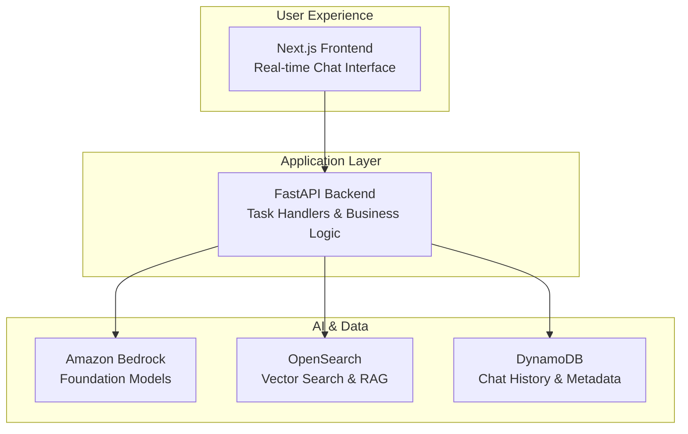

# Chat Workbench

**A production-ready AI application accelerator for building custom chat experiences with Amazon Bedrock**

Chat Workbench provides the foundation for developing and deploying AI-powered applications - from basic chatbots to deep research engines with RAG and tool calling, multi-agent systems, and autonomous workflows. Built on Amazon Bedrock with a modern full-stack architecture, it handles infrastructure complexity so you can focus on your AI logic.

## What You Can Build

- **Conversational AI Applications** - Domain-specific assistants with persistent memory
- **RAG-Powered Q&A Systems** - Query organizational documents with semantic search
- **Custom AI Workflows** - Multi-step processes with user interaction
- **Document Analysis Tools** - AI-assisted content processing and insights
- **Rapid Prototypes** - Test AI concepts before scaling to production

## Key Features

### Enterprise-Ready Foundation

- Amazon Bedrock integration with multiple foundation models
- Production-grade authentication and security
- Auto-scaling infrastructure with AWS CDK
- Comprehensive monitoring and observability

### Developer Experience

- Hot-reloading development environment
- Type-safe APIs with comprehensive documentation
- Extensible task handler system for custom AI logic
- Rich component library and UI patterns
- Bring Your Own Container (BYOC) deployment support

### AI Capabilities

- Real-time streaming responses
- Multimodal support (text, images, documents)
- RAG with OpenSearch integration
- Content safety and guardrails
- Token usage optimization

## Quick Start

### Prerequisites

- Docker & Docker Compose installed
- AWS CLI configured (`aws sts get-caller-identity` should work)
- AWS account with Amazon Bedrock access enabled

### Setup Steps

```bash
# 1. Clone and setup environment
git clone <repository-url>
cd chat-workbench
cp .env.example .env

# 2. Launch application stack
docker compose up -d

# 3. Setup database tables
python scripts/setup_ddb.py
```

**AWS Employees**: Instead of manual AWS setup, use:

```bash
./scripts/isengard_local_dev_setup.sh --email your.email@amazon.com
```

### Access the Application

- Open http://localhost:3000
- Login: `admin` / `admin`
- Select a model and start chatting

### Troubleshooting

- **AWS credentials error**: Run `aws configure` and verify with `aws sts get-caller-identity`
- **Bedrock access denied**: Enable models in AWS Bedrock console
- **Port conflicts**: Stop services using ports 3000, 8000, 8080
- **Database reset**: Use `RESET_TABLE=true python scripts/setup_ddb.py`

### For Developers (Build Custom Features)

Ready to extend Chat Workbench? Check out our comprehensive developer documentation:

**[Developer Documentation →](docs/README.md)**

Quick developer setup:

```bash
git clone <repository-url>
cd chat-workbench
cp .env.example .env
docker compose up -d
```

## Architecture Overview



**Core Concept**: Task handlers are your custom AI application logic. The included chat handler is just a starting point - build RAG systems, document processors, workflow automation, or any AI-powered feature you need.

## Use Cases

### Customer Support Enhancement

- Deploy AI assistants that understand your product documentation
- Provide instant, accurate responses based on your knowledge base
- Handle complex multi-turn conversations with context retention

### Internal Knowledge Management

- Build Q&A systems for organizational documents
- Enable employees to quickly find information across large document sets
- Integrate with existing tools and workflows

### Content & Document Processing

- Automate document analysis and summarization
- Extract insights from large volumes of text
- Generate reports and structured data from unstructured content

### AI Application Prototyping

- Rapidly test new AI concepts and workflows
- Validate ideas before investing in custom development
- Experiment with different foundation models and approaches

## Technology Stack

- **Frontend**: Next.js 15, React 19, TypeScript, Tailwind CSS
- **Backend**: FastAPI, Python 3.11+, Pydantic v2
- **AI Platform**: Amazon Bedrock (Claude, Titan models)
- **Data Layer**: DynamoDB, OpenSearch, S3, MemoryDB Redis
- **Infrastructure**: AWS CDK, Docker, ECS Fargate
- **Authentication**: Cognito, Keycloak, JWT

## Documentation

### Getting Started

- [Developer Setup Guide](docs/GETTING-STARTED.md) - Complete environment setup
- [Architecture Overview](docs/ARCHITECTURE.md) - System design and data flow
- [API Reference](docs/API-REFERENCE.md) - Complete API documentation

### Development Guides

- [Frontend Development](ui/README.md) - Next.js patterns and components
- [Backend Development](backend/README.md) - FastAPI and AI integration
- [Infrastructure Guide](infrastructure/cdk/README.md) - AWS deployment and CDK

### Examples & Tutorials

- [RAG Example](examples/rag_oss/README.md) - Build a document Q&A system
- [Custom Task Handlers](backend/README.md#creating-custom-task-handlers) - Extend AI capabilities

## Deployment Options

### Local Development

```bash
docker compose up -d  # Full stack with hot reload
```

### AWS Cloud (Production)

```bash
cd infrastructure/cdk
npm install
ENV=production npm run cdk deploy --all
```

### GovCloud/Windows-only environments

```bash
./scripts/deploy_cloudshell.sh  # For environments where EC2 Linux instances aren't available
```

### Custom Configurations

- Component-specific deployments (API-only, UI-only)
- Multiple environments (dev, staging, production)
- Custom domain and SSL certificate setup

## Contributing

We welcome contributions! Whether you're fixing bugs, adding features, or improving documentation:

1. Check out our [Development Guide](docs/GETTING-STARTED.md)
2. Review the [Architecture Documentation](docs/ARCHITECTURE.md)
3. Follow our coding standards and submit a pull request
