# Chat Workbench Architecture Guide

This guide provides a focused overview of the Chat Workbench system architecture, detailing its key components, design patterns, and data flows.

## System Overview

Chat Workbench is a full-stack AI application accelerator designed for building custom chat experiences with Amazon Bedrock. It consists of a Next.js frontend, FastAPI backend, and comprehensive AWS infrastructure managed through CDK.

### High-Level Architecture


## Core Architectural Principles

### 1. Task Handler System - Extensible AI Processing

**Task handlers are the heart of Chat Workbench's extensibility.** They are pluggable components that implement custom AI application logic, making the system far more than just a chat interface.

#### How Task Handlers Work


#### Task Handler Examples

1. **RAG (Retrieval-Augmented Generation)**:
   - Rephrase user queries for better search
   - Generate embeddings using Bedrock
   - Search OpenSearch for relevant context
   - Inject context into LLM prompts

2. **Document Processing**:
   - Extract text from uploaded files
   - Analyze content for insights
   - Generate summaries or reports

3. **Workflow Automation**:
   - Multi-step business processes
   - External API integrations
   - User interaction loops

#### Creating Custom Task Handlers

```python
class CustomTaskHandler(BaseTaskHandler):
    @property
    def name(self) -> str:
        return "custom_task"

    async def handle(self, chat_id: str, message: Message, **context) -> AsyncGenerator:
        # Your custom AI logic here
        # 1. Process user input
        # 2. Call external services
        # 3. Generate AI response
        # 4. Stream results back
        yield TaskHandlerResult(message=response)
```

#### Standardized Example-Handler Workflow

Chat Workbench follows a standardized pattern for creating AI capabilities through synchronized examples and task handlers:

```mermaid
graph TB
    subgraph "Example Directory"
        EXAMPLE["📁 examples/rag_oss/"]
        README["README.md\nUser Guide"]
        CONFIG["config.yaml\nConfiguration"]
        DATA["data/\nSample Data"]
        SCRIPTS["scripts/\nData Prep"]
    end

    subgraph "Task Handler"
        HANDLER_DIR["📁 backend/app/task_handlers/rag_oss/"]
        HANDLER["handler.py\nRagOssHandler"]
        PROMPTS["prompts/\nTemplates"]
    end

    subgraph "System Integration"
        REGISTRY["registry.py\nHandler Registration"]
        API["API Endpoints\n/generate/stream?task=rag_oss"]
        DB["DynamoDB\nHandler Configuration"]
    end

    EXAMPLE -.->|mirrors| HANDLER_DIR
    README -.->|documents| HANDLER
    CONFIG -.->|configures| HANDLER
    SCRIPTS -.->|prepares data for| HANDLER

    HANDLER --> REGISTRY
    REGISTRY --> API
    REGISTRY --> DB
```



**Key Principles:**

1. **1:1 Naming Convention**: `examples/example_name/` ↔ `backend/app/task_handlers/example_name/`
2. **Class Naming**: `ExampleNameHandler` with `name = 'example_name'`
3. **Manual Registration**: Handlers must be explicitly imported and registered in `registry.py`
4. **Configuration Flow**: `config.yaml` → Pydantic Settings → Handler Dependencies
5. **Automatic Management**: DynamoDB configuration and guardrails are auto-configured

This pattern ensures:

- **Developer Clarity**: Easy to understand the relationship between examples and handlers
- **Maintainability**: Changes to examples and handlers stay synchronized
- **Scalability**: New AI capabilities can be added following the established pattern
- **Consistency**: All examples follow the same structure and conventions

For detailed implementation instructions, see the [Creating Examples Guide](guides/CREATING_EXAMPLES.md).

### 2. Layered Backend Architecture

The FastAPI backend uses a clean layered architecture with dependency injection:


#### Request Flow

1. **Middleware Processing**: Authentication, logging, rate limiting
2. **Route Resolution**: FastAPI routes to appropriate handler
3. **Dependency Injection**: Services and repositories are injected
4. **Business Logic**: Services orchestrate the request processing
5. **Task Handler Execution**: Custom AI logic runs (if applicable)
6. **Data Operations**: Repositories handle database interactions
7. **Response Streaming**: Results stream back to the client

### 3. Frontend State Management

The Next.js frontend uses a sophisticated state management approach:


## Authentication Architecture

Chat Workbench implements enterprise-grade authentication using OIDC/JWT:


### Key Authentication Components

- **Identity Provider**: Keycloak (development) or Cognito (production)
- **Frontend**: Handles OIDC flow and secure token storage
- **Backend**: JWT validation using public keys (JWKS)
- **Session Management**: Secure HTTP-only cookies

### Security Features

- **Token Validation**: Signature verification using JWKS
- **Secure Storage**: HTTP-only cookies prevent XSS
- **Development Bypass**: Optional auth bypass for development only
- **Automatic Refresh**: Token refresh handled transparently

For a detailed, end-to-end explanation of the OIDC authentication flow, see the [Authentication Flow Guide](guides/AUTHENTICATION_FLOW.md).

## Data Layer Design

### DynamoDB - Single Table Pattern

All application data uses a single DynamoDB table with carefully designed access patterns:

```
Table: chat-workbench-data
Primary Key: PK (Partition Key) + SK (Sort Key)

Access Patterns:
┌─────────────────────────────────────────────────────────────┐
│ Entity Type │ PK                    │ SK                    │
├─────────────────────────────────────────────────────────────┤
│ Chat        │ CHAT#{chat_id}        │ METADATA              │
│ Message     │ CHAT#{chat_id}        │ MESSAGE#{message_id} │
│ User        │ USER#{user_id}        │ METADATA              │
│ Persona     │ PERSONA#{persona_id}  │ METADATA              │
│ Prompt      │ PROMPT#{prompt_id}    │ METADATA              │
└─────────────────────────────────────────────────────────────┘

Global Secondary Indexes:
- GSI1: User-based queries (gsi1pk=USER#{user_id})
- GSI2: Category-based queries (gsi2pk=CATEGORY#{type})
```

### OpenSearch - Vector Search & RAG

OpenSearch provides semantic search capabilities for RAG applications:


### Data Flow Patterns

#### Chat Message Flow


#### RAG Document Processing


## Infrastructure Architecture

### AWS CDK Multi-Stack Design


### Production Network Architecture

Chat Workbench supports deployment in both **Commercial AWS** and **AWS GovCloud** with automatic detection and configuration.

#### Commercial AWS Deployment

In commercial AWS environments, the architecture leverages CloudFront for global content delivery and DDoS protection. **A critical architectural requirement is that AWS WAF rules for CloudFront distributions must be deployed in the `us-east-1` (N. Virginia) region**, regardless of the main application's deployment region.

This AWS service constraint requires a **multi-stack, cross-region CDK deployment**:

- A dedicated CDK WAF stack deploys WAF resources to `us-east-1`
- The WebACL ARN is passed to the primary application stack via cross-region references
- CDK automatically handles the CloudFormation exports and imports between regions


#### AWS GovCloud Deployment


#### Key Deployment Differences

| Feature              | Commercial AWS              | AWS GovCloud      |
| -------------------- | --------------------------- | ----------------- |
| **CloudFront**       | ✅ Available                | ❌ Not Available  |
| **WAF Scope**        | `CLOUDFRONT`                | `REGIONAL`        |
| **ALB Exposure**     | Behind CloudFront           | Direct Internet   |
| **SSL Termination**  | CloudFront (primary)        | ALB Only          |
| **Region Detection** | Auto (`us-*`, `eu-*`, etc.) | Auto (`us-gov-*`) |
| **Partition ARNs**   | `arn:aws:`                  | `arn:aws-us-gov:` |

---

## Container Deployment Patterns

Chat Workbench supports two distinct container deployment patterns to accommodate different development and production workflows.

### Traditional Docker Build Pattern

The traditional approach builds containers during CDK deployment, ideal for development and simple deployment scenarios.


**Characteristics:**

- Container images built during `cdk deploy`
- Suitable for development and testing environments
- Tightly coupled infrastructure and application deployment
- Longer deployment times due to build process

### Bring Your Own Container (BYOC) Pattern

The BYOC approach uses pre-built container images from ECR, enabling faster deployments and decoupled release cycles.


**Characteristics:**

- Pre-built container images stored in ECR
- Decoupled application and infrastructure deployments
- Faster deployment times (no build required)
- Ideal for production and CI/CD workflows

### Container Image Lifecycle

Both patterns support comprehensive container image lifecycle management:


### IAM Permissions Architecture

BYOC requires specific IAM permissions for ECR access:


### Configuration Schema Integration

The deployment pattern is determined by configuration schema validation:

```typescript
// Mutual exclusion validation
const ApiConfigSchema = z
  .object({
    ecrContainer: EcrContainerConfigSchema.optional(),
    // traditional build settings...
  })
  .refine((data) => {
    // Ensure only one deployment pattern is used
    return !!data.ecrContainer !== !!data.dockerBuild;
  });
```

### Deployment Performance Comparison

| Metric                | Traditional Build | BYOC        |
| --------------------- | ----------------- | ----------- |
| **Initial Deploy**    | 10-15 minutes     | 3-5 minutes |
| **Update Deploy**     | 8-12 minutes      | 2-3 minutes |
| **Rollback Time**     | 8-12 minutes      | 1-2 minutes |
| **Build Coupling**    | High              | None        |
| **CI/CD Integration** | Basic             | Advanced    |

## Performance & Scalability

### Auto-Scaling Strategy

- **ECS Services**: CPU and memory-based auto-scaling
- **DynamoDB**: On-demand billing with automatic scaling
- **OpenSearch**: Cluster auto-scaling based on usage
- **CDN**: Global edge caching for static assets

### Caching Strategy

1. **CDN Level**: Static assets cached at CloudFront edge locations
2. **Application Level**: Redis caching for frequently accessed data
3. **Database Level**: DynamoDB DAX for microsecond latency
4. **Frontend Level**: React Query for intelligent client-side caching

### Monitoring & Observability

- **Application Metrics**: Custom Prometheus metrics
- **Infrastructure Metrics**: CloudWatch monitoring
- **Distributed Tracing**: Request correlation across services
- **Real-time Alerts**: CloudWatch alarms and SNS notifications

## Security Architecture

### Defense in Depth Strategy

Chat Workbench implements a comprehensive security model with multiple layers of protection:


### Mandatory WAF Protection

**AWS WAF v2 is always enabled** and cannot be disabled for security reasons:

#### Managed Rule Groups

- **Known Bad Inputs**: Protects against common attack patterns
- **Amazon IP Reputation List**: Blocks requests from known malicious IPs
- **Core Rule Set**: Optional (can be strict for some applications)

#### Rate Limiting

- **Default**: 2000 requests per 5-minute period per IP
- **Window**: 5-minute rolling window (AWS WAF standard)
- **Configurable**: 100-20,000 requests per 5-minute period range

#### WAF Deployment Modes

| Environment        | Scope        | Association               | Features               | Region      |
| ------------------ | ------------ | ------------------------- | ---------------------- | ----------- |
| **Commercial AWS** | `CLOUDFRONT` | CloudFront Distribution   | Global edge protection | us-east-1   |
| **AWS GovCloud**   | `REGIONAL`   | Application Load Balancer | Regional protection    | Same as app |

### SSL/HTTPS Configuration

**Flexible SSL certificate support** for enhanced security:

#### Certificate Sources

- **AWS Certificate Manager (ACM)**: Recommended for production
- **AWS IAM**: For imported certificates (including self-signed)
- **Auto-Detection**: Supports both certificate types seamlessly

#### HTTPS Listener Configuration

```yaml
loadBalancerConfig:
  sslCertificateArn: 'arn:aws:acm:region:account:certificate/cert-id'
  # Note: HTTPS redirect is automatically configured based on deployment type
```

#### Dynamic Security Group Rules

- **With SSL**: Opens port 443 (HTTPS) + optional port 80 (redirect)
- **Without SSL**: Opens port 80 (HTTP) only
- **Automatic**: Rules configured based on certificate presence

### GovCloud Security Considerations

**Additional security measures for government cloud deployments:**

#### Partition-Aware Security

- **ARN Construction**: All ARNs use `${AWS::Partition}` for cross-partition compatibility
- **Service Availability**: Automatic detection of service availability per partition
- **Compliance**: Maintains security posture across different AWS partitions

#### Enhanced ALB Security

- **Direct Exposure**: ALB directly internet-facing in GovCloud
- **Regional WAF**: Comprehensive protection at ALB level
- **SSL Termination**: Configurable HTTPS support at load balancer

### Security Controls Summary

| Layer           | Control         | Implementation                | Benefits                      |
| --------------- | --------------- | ----------------------------- | ----------------------------- |
| **Edge**        | WAF v2          | Always enabled, managed rules | DDoS + application protection |
| **Network**     | Security Groups | Dynamic port management       | Least privilege access        |
| **Transport**   | SSL/TLS         | Configurable HTTPS            | Data in transit protection    |
| **Application** | JWT/OIDC        | Token-based authentication    | Stateless security            |
| **Data**        | Encryption      | At rest + in transit          | Comprehensive data protection |
| **Compliance**  | Partition-aware | Cross-partition ARNs          | Government cloud ready        |

### Security Best Practices

1. **Always-On WAF**: Non-configurable protection ensures consistent security baseline
2. **SSL by Default**: HTTPS redirect enabled by default when certificates are configured
3. **Dynamic Configuration**: Security rules adapt to deployment environment automatically
4. **Zero Trust Network**: All internal communications use private subnets and security groups
5. **Audit Trail**: Complete request logging and monitoring across all layers
