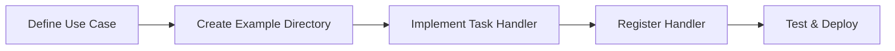

# Chat Workbench Developer Documentation

Welcome to the Chat Workbench developer hub! This documentation is designed to help you understand, extend, and deploy Chat Workbench effectively.

## Start Here

### New to Chat Workbench?

1. **[Getting Started Guide](GETTING-STARTED.md)** - Set up your development environment
2. **[Architecture Overview](ARCHITECTURE.md)** - Understand the system design
3. **[Creating Examples & Task Handlers](guides/CREATING_EXAMPLES.md)** - Build your first AI feature

### Quick Reference

- **[Configuration Reference](CONFIGURATION-REFERENCE.md)** - Complete config.yaml settings guide
- **[API Reference](API-REFERENCE.md)** - Complete endpoint documentation
- **[Component Guides](#component-guides)** - Frontend, backend, and infrastructure
- **[Deployment Guide](../infrastructure/cdk/README.md)** - Production deployment strategies

## Core Documentation

### Essential Guides

| Guide                                                     | What You'll Learn                                                 | Time Investment    |
| --------------------------------------------------------- | ----------------------------------------------------------------- | ------------------ |
| **[Getting Started](GETTING-STARTED.md)**                 | Complete development setup, running locally, basic workflows      | 30-45 minutes      |
| **[Architecture](ARCHITECTURE.md)**                       | System design, data flow, key concepts, scaling patterns          | 20-30 minutes      |
| **[Configuration Reference](CONFIGURATION-REFERENCE.md)** | All config.yaml options, logging, S3 lifecycle, security settings | Reference document |
| **[API Reference](API-REFERENCE.md)**                     | All endpoints, request/response formats, authentication           | Reference document |

### Development Deep Dives

| Guide                                                        | Focus Area                                                          | Best For            |
| ------------------------------------------------------------ | ------------------------------------------------------------------- | ------------------- |
| **[Creating Examples](guides/CREATING_EXAMPLES.md)**         | Step-by-step example creation, naming conventions, best practices   | All developers      |
| **[Task Handlers Technical Guide](guides/TASK_HANDLERS.md)** | Event system, streaming, advanced patterns, performance             | Backend developers  |
| **[Authentication Flow](guides/AUTHENTICATION_FLOW.md)**     | End-to-end OIDC/JWT authentication process, security implementation | All developers      |
| **[Tracing with Jaeger](guides/TRACING.md)**                 | Distributed tracing, OpenTelemetry, Strands integration             | Backend developers  |
| **[Frontend Development](../ui/README.md)**                  | Next.js patterns, React components, state management, UI/UX         | Frontend developers |
| **[Backend Development](../backend/README.md)**              | FastAPI architecture, AI integration, databases                     | Backend developers  |
| **[Infrastructure Guide](../infrastructure/cdk/README.md)**  | AWS CDK, deployment strategies, monitoring, security                | DevOps engineers    |

## Component Guides

### Frontend (Next.js + React)

- **Tech Stack**: Next.js 15, React 19, TypeScript, Tailwind CSS
- **Key Concepts**: Server-side rendering, React Query for state, component composition
- **[Detailed Guide →](../ui/README.md)**

### Backend (FastAPI + Python)

- **Tech Stack**: FastAPI, Python 3.11+, Pydantic v2, Amazon Bedrock
- **Key Concepts**: Task handlers, async processing, AI model integration
- **[Detailed Guide →](../backend/README.md)**

### Infrastructure (AWS CDK)

- **Tech Stack**: AWS CDK, TypeScript, Docker, ECS Fargate
- **Key Concepts**: Multi-stack architecture, auto-scaling, security patterns
- **[Detailed Guide →](../infrastructure/cdk/README.md)**

## Common Development Scenarios

### Building Your First AI Feature

**Start Here**: [Creating Examples & Task Handlers Guide](guides/CREATING_EXAMPLES.md)

### Extending the Frontend

1. **Add New Pages**: [Page Creation Guide](../ui/README.md#creating-new-features)
2. **Custom Components**: [Component Development](../ui/README.md#ui-components)
3. **State Management**: [React Query Integration](../ui/README.md#state-management)

### Infrastructure Customization

1. **New Environments**: [Environment Setup](../infrastructure/cdk/README.md#environment-specific-deployment)
2. **Custom Services**: [Adding AWS Services](../infrastructure/cdk/README.md#stack-architecture)
3. **Monitoring**: [Observability Setup](../infrastructure/cdk/README.md#monitoring-and-observability)

## Learning Paths

### Frontend Developer Path

1. [Getting Started](GETTING-STARTED.md) → [Architecture](ARCHITECTURE.md) → [Frontend Development](../ui/README.md)
2. **Hands-on**: Build a custom chat interface component
3. **Advanced**: Implement real-time features and optimizations

### Backend Developer Path

1. [Getting Started](GETTING-STARTED.md) → [Architecture](ARCHITECTURE.md) → [Creating Examples](guides/CREATING_EXAMPLES.md)
2. **Hands-on**: Build your first task handler following the standardized pattern
3. **Advanced**: [Task Handlers Technical Guide](guides/TASK_HANDLERS.md) → Integrate new AI models and optimize performance

### Full-Stack Developer Path

1. [Getting Started](GETTING-STARTED.md) → [Architecture](ARCHITECTURE.md) → [Creating Examples](guides/CREATING_EXAMPLES.md)
2. [Task Handlers Guide](guides/TASK_HANDLERS.md) → [Frontend Development](../ui/README.md)
3. **Hands-on**: Build an end-to-end AI feature (Backend + Frontend)
4. **Advanced**: [Infrastructure](../infrastructure/cdk/README.md) and deployment

### DevOps Engineer Path

1. [Getting Started](GETTING-STARTED.md) → [Architecture](ARCHITECTURE.md) → [Infrastructure](../infrastructure/cdk/README.md)
2. **Hands-on**: Deploy to AWS with custom configurations
3. **Advanced**: Set up monitoring, security, and CI/CD pipelines

## Reference Materials

### Architecture Patterns

- [Task Handler System](guides/CREATING_EXAMPLES.md) - Extensible AI processing with standardized patterns
- [Event-Driven Streaming](guides/TASK_HANDLERS.md#event-system-deep-dive) - Real-time response streaming
- [Authentication Flow](guides/AUTHENTICATION_FLOW.md) - End-to-end OIDC/JWT process, security implementation
- [Data Management](ARCHITECTURE.md#data-layer-design) - DynamoDB, OpenSearch, caching strategies

### Development Workflows

- [Local Development](GETTING-STARTED.md#development-workflow) - Hot reload, testing, debugging
- [Code Organization](ARCHITECTURE.md#core-architectural-principles) - File structure and conventions
- [Testing Strategies](../backend/README.md#testing) - Unit, integration, and E2E testing

### Deployment Patterns

- [Environment Management](../infrastructure/cdk/README.md#environment-specific-deployment) - Dev, staging, production
- [Scaling Strategies](../infrastructure/cdk/README.md#monitoring-and-observability) - Handle growth and traffic
- [Security Best Practices](../infrastructure/cdk/README.md#security-configuration) - Production-ready security

## Finding What You Need

### I want to...

- **Set up my development environment** → [Getting Started Guide](GETTING-STARTED.md)
- **Understand the system architecture** → [Architecture Overview](ARCHITECTURE.md)
- **Build a custom AI feature** → [Creating Examples Guide](guides/CREATING_EXAMPLES.md)
- **Learn advanced task handler patterns** → [Task Handlers Technical Guide](guides/TASK_HANDLERS.md)
- **Add new API endpoints** → [API Development Guide](../backend/README.md#development-patterns)
- **Create frontend components** → [Frontend Development Guide](../ui/README.md)
- **Deploy to production** → [Infrastructure Guide](../infrastructure/cdk/README.md)
- **Find API documentation** → [API Reference](API-REFERENCE.md)
- **Set up distributed tracing** → [Tracing with Jaeger Guide](guides/TRACING.md)
- **Troubleshoot issues** → Check the troubleshooting sections in each guide

### I'm working on...

- **Creating new examples** → [Creating Examples Guide](guides/CREATING_EXAMPLES.md)
- **Task handler development** → [Task Handlers Technical Guide](guides/TASK_HANDLERS.md)
- **Chat interfaces** → [Frontend Development](../ui/README.md#ui-components)
- **AI model integration** → [Task Handlers Guide](guides/TASK_HANDLERS.md#bedrock-integration)
- **Distributed tracing** → [Tracing with Jaeger Guide](guides/TRACING.md)
- **RAG systems** → [RAG Example](../examples/rag_oss/README.md) + [Creating Examples](guides/CREATING_EXAMPLES.md#using-existing-retrieval-tools)
- **Authentication** → [Authentication Flow Guide](guides/AUTHENTICATION_FLOW.md) + [Architecture Overview](ARCHITECTURE.md#authentication-architecture)
- **Configuration & secrets** → [Creating Examples: Configuration Management](guides/CREATING_EXAMPLES.md#configuration-and-secrets-management)
- **AWS deployment** → [Infrastructure Guide](../infrastructure/cdk/README.md)

## Contributing to Documentation

Found something unclear or missing? We'd love your help improving these docs:

1. **Quick Fixes**: Edit markdown files directly and submit a pull request
2. **Larger Changes**: Open an issue to discuss your proposed improvements
3. **New Guides**: Follow our [documentation standards](GETTING-STARTED.md#documentation-standards)

## Getting Help

- **Documentation Issues**: Check if information is missing or unclear
- **Development Questions**: Review the relevant guide and troubleshooting sections
- **Bug Reports**: Include steps to reproduce and your environment details
- **Feature Requests**: Describe your use case and proposed implementation
