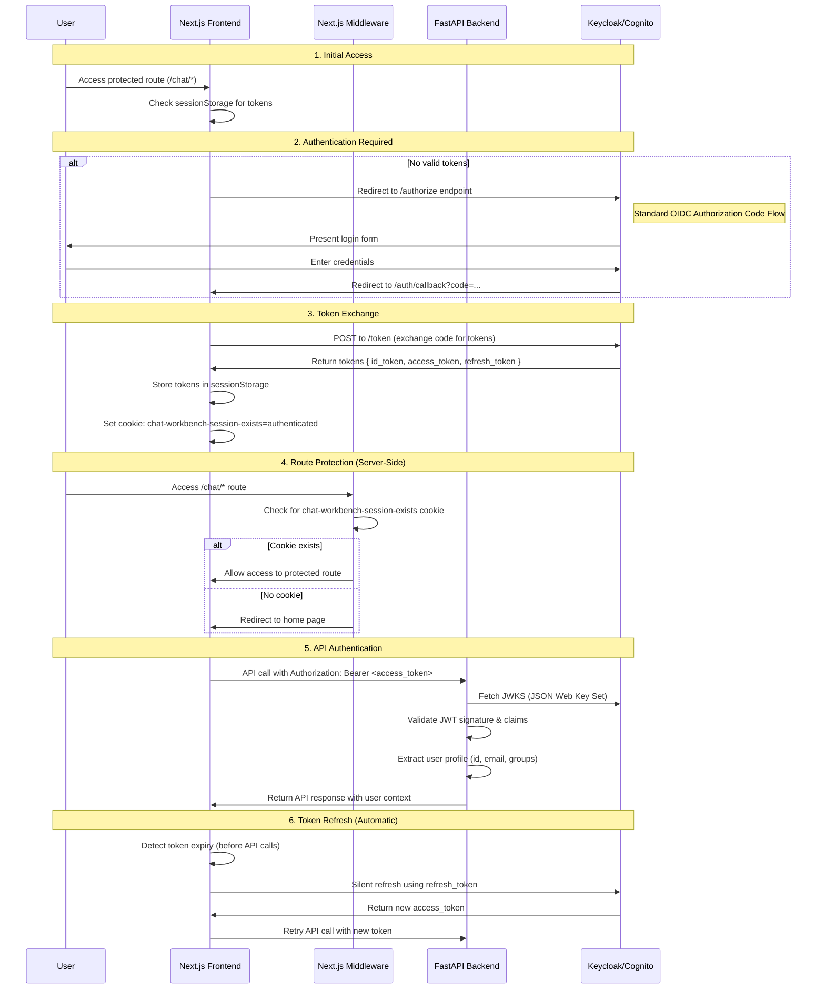

# Guide: OIDC Authentication Flow

This guide provides a comprehensive overview of the OpenID Connect (OIDC) authentication implementation in Chat Workbench, covering the end-to-end flow from user login to authenticated API calls.

## Overview

Chat Workbench implements industry-standard OIDC authentication with support for multiple identity providers:

- **Local Development**: Keycloak (containerized)
- **Cloud Deployment**: AWS Cognito
- **Protocol**: OpenID Connect (OIDC) with JWT tokens
- **Frontend**: React with `react-oidc-context` library
- **Backend**: FastAPI with JWT validation
- **Security**: Stateless authentication with automatic token refresh

## Architecture Components

### Frontend (Next.js)

- **OIDC Client**: `react-oidc-context` handles the OAuth2/OIDC flow
- **Token Storage**: Secure in-memory storage via `sessionStorage`
- **Auth Interceptor**: Automatic `Authorization: Bearer` header injection
- **Route Protection**: Client-side and server-side middleware guards
- **Session Cookie**: `chat-workbench-session-exists` for middleware detection

### Backend (FastAPI)

- **JWT Validation**: Signature verification using JWKS (JSON Web Key Set)
- **Token Introspection**: Claims extraction and user profile creation
- **Route Protection**: Dependency injection with `Depends(get_current_user)`
- **Provider Compatibility**: Support for both Keycloak and Cognito token formats

### Infrastructure

- **Keycloak**: Local development OIDC provider
- **AWS Cognito**: Cloud-hosted identity provider with CDK automation
- **Dynamic Configuration**: Runtime configuration via environment variables

## Authentication Flow

### Complete OIDC Authorization Code Flow



## Component Implementation Details

### 1. Frontend Authentication (`ui/hooks/auth/use-auth-provider.tsx`)

#### OIDC Configuration

```typescript
const authConfig = {
  authority: process.env.AUTH_AUTHORITY, // Keycloak or Cognito endpoint
  client_id: process.env.AUTH_CLIENT_ID,
  redirect_uri: `${window.location.origin}/auth/callback`,
  scope: 'openid profile email',
  response_type: 'code',
  automaticSilentRenew: true,
};
```

#### Token Management

- **Storage**: Tokens stored in `sessionStorage` (not accessible to server)
- **Security Cookie**: `chat-workbench-session-exists` set for middleware detection
- **Automatic Refresh**: Background token renewal before expiration
- **Logout Cleanup**: Comprehensive state clearing on logout

#### Authentication State Management

```typescript
const authState = {
  isAuthenticated: boolean,
  isLoading: boolean,
  user: User | null,
  userProfile: {
    id: string,
    email: string,
    groups: string[],
    isAdmin: boolean
  }
};
```

### 2. Route Protection (`ui/middleware.ts`)

#### Server-Side Protection

The middleware provides the first layer of protection for server-rendered routes:

```typescript
// Check for authentication indicators
const hasAuthCookie = cookieNames.some((name) => {
  // Primary: Our application-specific session cookie
  if (name === 'chat-workbench-session-exists') return true;

  // Fallback: Standard OIDC/OAuth cookies
  if (name.startsWith('oidc.user:')) return true;
  if (name.includes('CognitoIdentity')) return true;

  return false;
});

// Redirect unauthenticated users
if (isProtectedRoute && !hasAuthCookie) {
  return NextResponse.redirect(new URL('/', request.url));
}
```

**Note**: The middleware cannot access `sessionStorage` (client-side only), so it relies on the `chat-workbench-session-exists` cookie as a session indicator.

### 3. Backend JWT Validation (`backend/app/api/dependencies/auth/bearer.py`)

#### OIDC Discovery and JWKS

```python
async def initialize(self):
    # Fetch OIDC provider configuration
    config_url = f"{self.authority}/.well-known/openid-configuration"
    config = await self._fetch_json(config_url)

    # Initialize JWT validation with provider's public keys
    self.jwks_client = jwt.PyJWKClient(config["jwks_uri"])
```

#### JWT Token Validation

```python
def decode_jwt(self, token: str) -> dict:
    # Get signing key from JWKS
    signing_key = self.jwks_client.get_signing_key_from_jwt(token)

    # Validate token signature and claims
    payload = jwt.decode(
        token,
        signing_key.key,
        algorithms=["RS256"],
        issuer=self.authority,
        audience=self.client_id,
        options={"verify_exp": True}
    )

    return payload
```

#### User Profile Extraction

```python
def extract_user_info(self, payload: dict) -> dict:
    # Support both Keycloak and Cognito token formats
    user_id = (
        payload.get("sub") or
        payload.get("cognito:username") or
        payload.get("preferred_username")
    )

    # Extract groups/roles
    groups = (
        payload.get("cognito:groups", []) or  # Cognito
        payload.get("groups", []) or          # Keycloak groups
        payload.get("realm_access", {}).get("roles", [])  # Keycloak roles
    )

    return {
        "id": user_id,
        "email": payload.get("email"),
        "name": payload.get("name"),
        "groups": groups,
        "is_admin": "admin" in groups
    }
```

## Provider-Specific Configuration

### Keycloak (Local Development)

#### Docker Configuration

```yaml
# infrastructure/keycloak/docker-compose.yml
services:
  keycloak:
    image: quay.io/keycloak/keycloak:latest
    environment:
      KEYCLOAK_ADMIN: admin
      KEYCLOAK_ADMIN_PASSWORD: admin
    ports:
      - '8080:8080'
    command: start-dev
```

#### Client Configuration

- **Authority**: `http://localhost:8080/realms/chat-workbench`
- **Client ID**: `chat-workbench-ui`
- **Redirect URIs**: `http://localhost:3000/auth/callback`
- **Scopes**: `openid`, `profile`, `email`

### AWS Cognito (Cloud Deployment)

#### CDK Infrastructure

```typescript
// infrastructure/cdk/lib/infrastructure-stack.ts
const userPool = new cognito.UserPool(this, 'UserPool', {
  userPoolName: `${config.projectName}-user-pool`,
  selfSignUpEnabled: true,
  signInCaseSensitive: false,
  standardAttributes: {
    email: { required: true, mutable: true },
    givenName: { required: true, mutable: true },
    familyName: { required: true, mutable: true },
  },
});

const userPoolClient = new cognito.UserPoolClient(this, 'UserPoolClient', {
  userPool,
  userPoolClientName: `${config.projectName}-client`,
  authFlows: {
    userSrp: true,
    authorizationCodeGrant: true,
  },
  oAuth: {
    flows: { authorizationCodeGrant: true },
    scopes: [
      cognito.OAuthScope.OPENID,
      cognito.OAuthScope.EMAIL,
      cognito.OAuthScope.PROFILE,
    ],
    callbackUrls: [frontendUrl + '/auth/callback'],
    logoutUrls: [frontendUrl],
  },
});
```

#### Runtime Configuration

```javascript
// ui/public/env.js (generated at deployment)
window.env = {
  AUTH_AUTHORITY:
    'https://cognito-idp.us-east-1.amazonaws.com/us-east-1_XXXXXXXXX',
  AUTH_CLIENT_ID: 'your-cognito-client-id',
  API_BASE_URL: 'https://api.yourdomain.com',
};
```

## Security Features

### Token Security

- **Short-lived Access Tokens**: 1 hour expiration (configurable)
- **Secure Storage**: `sessionStorage` prevents XSS token theft
- **Automatic Refresh**: Background renewal prevents session interruption
- **Logout Cleanup**: Complete token and state clearing

### Cookie Security

```typescript
// Production cookie security
const isProd = process.env.NODE_ENV === 'production';
const secureAttribute = isProd ? '; Secure' : '';
document.cookie = `chat-workbench-session-exists=authenticated; path=/; SameSite=Lax${secureAttribute}`;
```

### CORS Configuration

- **Allowed Origins**: Specific frontend domains only
- **Credentials**: `include` for cookie-based requests
- **Headers**: `Authorization`, `Content-Type`, `X-User-ID`

### Content Security Policy

```http
Content-Security-Policy:
  default-src 'self';
  script-src 'self' 'unsafe-inline';
  connect-src 'self' https://cognito-idp.*.amazonaws.com;
  frame-ancestors 'none';
```

## Token Lifecycle

### Access Token (JWT)

- **Purpose**: API authorization
- **Lifetime**: 1 hour (default)
- **Claims**: `sub` (user ID), `email`, `groups`, `exp`, `iss`, `aud`
- **Validation**: Signature verification + claims validation

### ID Token (JWT)

- **Purpose**: User identity information
- **Lifetime**: 1 hour (default)
- **Claims**: User profile data (`name`, `email`, `picture`)
- **Usage**: Frontend user display only

### Refresh Token (Opaque)

- **Purpose**: Access token renewal
- **Lifetime**: 30 days (default)
- **Security**: HTTP-only, secure cookie (optional)
- **Rotation**: New refresh token issued on each use

## API Integration

### Automatic Header Injection

```typescript
// lib/auth/auth-interceptor.ts
apiClient.interceptors.request.use((config) => {
  const token = getAccessToken();
  if (token) {
    config.headers.Authorization = `Bearer ${token}`;
    config.headers['X-User-ID'] = getUserId(); // Additional context
  }
  return config;
});
```

### Token Refresh Handling

```typescript
apiClient.interceptors.response.use(
  (response) => response,
  async (error) => {
    if (error.response?.status === 401) {
      try {
        await refreshToken();
        return apiClient.request(error.config); // Retry with new token
      } catch (refreshError) {
        redirectToLogin();
      }
    }
    return Promise.reject(error);
  },
);
```

## Environment Configuration

### Development Environment

```bash
# .env.local
AUTH_AUTHORITY=http://localhost:8080/realms/chat-workbench
AUTH_CLIENT_ID=chat-workbench-ui
AUTH_ENABLED=true
API_BASE_URL=http://localhost:8000
```

### Production Environment

```bash
# Environment variables (set via CDK)
AUTH_AUTHORITY=https://cognito-idp.us-east-1.amazonaws.com/us-east-1_XXXXXXXXX
AUTH_CLIENT_ID=${COGNITO_CLIENT_ID}
AUTH_ENABLED=true
API_BASE_URL=https://api.yourdomain.com
```

## Troubleshooting

### Common Issues

#### 1. "Token expired" errors

**Symptom**: API calls return 401 Unauthorized
**Solution**:

- Check token refresh configuration
- Verify `automaticSilentRenew: true` in OIDC config
- Check browser console for refresh errors

#### 2. "Invalid audience" errors

**Symptom**: JWT validation fails with audience mismatch
**Solution**:

- Verify `AUTH_CLIENT_ID` matches the token's `aud` claim
- Check OIDC provider client configuration

#### 3. CORS errors during authentication

**Symptom**: Browser blocks requests to auth provider
**Solution**:

- Verify redirect URIs in OIDC provider configuration
- Check CORS settings on auth provider
- Ensure HTTPS in production

#### 4. Silent refresh failures

**Symptom**: Users get logged out unexpectedly
**Solution**:

- Check third-party cookie settings in browser
- Verify iframe communication is not blocked
- Consider fallback to redirect-based refresh

### Debug Techniques

#### Frontend Debugging

```typescript
// Enable OIDC debug logging
const authConfig = {
  // ... other config
  silentRequestTimeoutInSeconds: 10,
  automaticSilentRenew: true,
  includeIdTokenInSilentRenew: true,
  // Enable for debugging
  loadUserInfo: true,
  debug: process.env.NODE_ENV === 'development',
};
```

#### Backend Debugging

```python
# Enable JWT debug logging
import logging
logging.getLogger("jwt").setLevel(logging.DEBUG)

# Validate token manually
try:
    payload = jwt.decode(token, verify=False)  # Skip verification for debugging
    print(f"Token payload: {payload}")
except Exception as e:
    print(f"Token decode error: {e}")
```

#### Network Debugging

```bash
# Check OIDC provider configuration
curl https://your-authority/.well-known/openid-configuration

# Test JWT validation
curl -H "Authorization: Bearer <token>" https://your-api/protected-endpoint

# Verify JWKS endpoint
curl https://your-authority/.well-known/jwks.json
```

### Configuration Validation

#### Verify OIDC Provider Setup

1. **Discovery Endpoint**: `https://authority/.well-known/openid-configuration`
2. **JWKS Endpoint**: `https://authority/.well-known/jwks.json`
3. **Token Endpoint**: `https://authority/token`
4. **Authorization Endpoint**: `https://authority/authorize`

#### Verify Client Configuration

1. **Redirect URIs**: Must match exactly (including protocol, port)
2. **Allowed Grant Types**: `authorization_code` required
3. **Allowed Scopes**: `openid` minimum, `profile email` recommended
4. **Token Lifetime**: Reasonable values (1 hour for access, 30 days for refresh)

## Related Documentation

- [Architecture Overview](../ARCHITECTURE.md#authentication-architecture) - High-level authentication architecture
- [Getting Started](../GETTING-STARTED.md) - Environment setup including auth configuration
- [Keycloak Setup](../../infrastructure/keycloak/README.md) - Local development identity provider
- [Auth Hooks](../../ui/hooks/auth/README.md) - Frontend authentication implementation details
- [API Reference](../API-REFERENCE.md) - Protected endpoint documentation

## Best Practices

### Security

- Always use HTTPS in production
- Implement proper CORS policies
- Use short-lived access tokens with automatic refresh
- Store tokens securely (avoid localStorage for sensitive data)
- Implement proper logout cleanup

### Performance

- Cache JWKS with appropriate TTL
- Use token validation caching for high-traffic APIs
- Implement silent token refresh to avoid interruptions
- Monitor token refresh failure rates

### Monitoring

- Track authentication success/failure rates
- Monitor token refresh patterns
- Alert on unusual authentication patterns
- Log security events for audit

### Development

- Use separate OIDC providers/realms for different environments
- Implement comprehensive error handling
- Add debug logging for troubleshooting
- Test authentication flows in different browsers
- Validate token expiration and refresh scenarios
