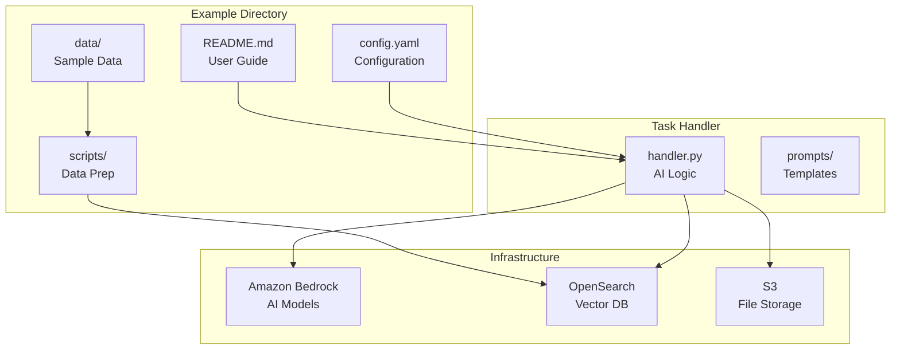
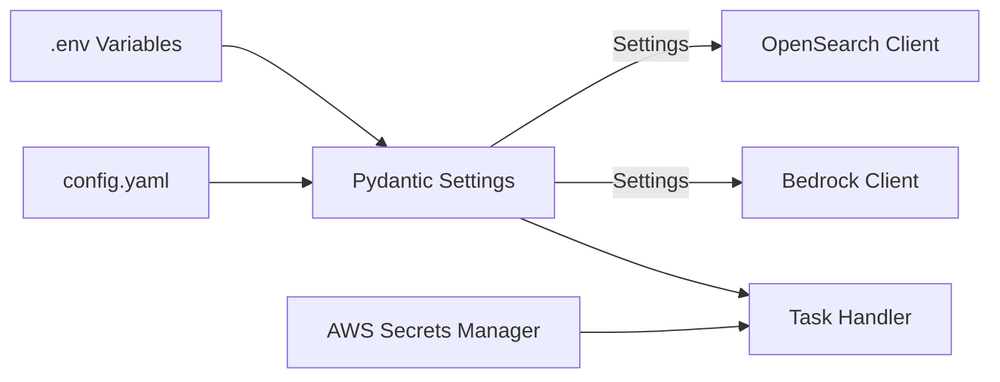

# Guide: Creating New Examples with Task Handlers

This guide provides a comprehensive, step-by-step workflow for creating new examples in Chat Workbench, following the standardized pattern established by the `rag_oss` example.

## Overview

In Chat Workbench, an "Example" consists of two synchronized components that work together to demonstrate AI capabilities:

1. **Example Directory** (`examples/example_name/`): Contains configuration, data, scripts, and documentation
2. **Task Handler** (`backend/app/task_handlers/example_name/`): Contains the backend logic that implements the feature

This creates a complete AI feature stack:



This guide will walk you through creating both components using the **standardized naming convention** that ensures clear mapping between examples and their handlers.

## Standardized Naming Convention

Chat Workbench follows a strict 1:1 naming pattern:

```
📁 examples/rag_oss/              ←→  📁 backend/app/task_handlers/rag_oss/
   └── README.md, config.yaml        └── handler.py (class: RagOssHandler, name: 'rag_oss')

📁 examples/document_analysis/    ←→  📁 backend/app/task_handlers/document_analysis/
   └── README.md, config.yaml        └── handler.py (class: DocumentAnalysisHandler, name: 'document_analysis')
```

**Key Pattern:**

- Directory names must match exactly
- Handler class name: `{ExampleName}Handler` (PascalCase)
- Handler name property: `'{example_name}'` (snake_case, matches directory)

## Step-by-Step Workflow

### Step 1: Plan Your Example

Before coding, define:

- **Purpose**: What AI capability will this demonstrate?
- **Data Requirements**: What sample data is needed?
- **Dependencies**: Which AWS services (Bedrock, OpenSearch, etc.)?
- **User Experience**: How will users interact with this example?

**Example Planning:**

```yaml
Name: document_analysis
Purpose: Analyze uploaded documents for key insights
Data: Sample PDFs, reports, contracts
Dependencies: Bedrock (Claude), S3 (file storage)
User Experience: Upload document → Ask questions → Get insights
```

### Step 2: Create the Task Handler

The task handler contains your custom AI logic. This is where the real work happens.

#### 2.1 Create Handler Directory Structure

```bash
mkdir -p backend/app/task_handlers/document_analysis
touch backend/app/task_handlers/document_analysis/__init__.py
touch backend/app/task_handlers/document_analysis/handler.py
```

#### 2.2 Implement the Handler Class

Create `backend/app/task_handlers/document_analysis/handler.py`:

```python
# Copyright © Amazon.com and Affiliates
"""Document analysis task handler for extracting insights from documents."""

import json
from collections.abc import AsyncGenerator
from typing import Any

from loguru import logger

from app.clients.bedrock_runtime.client import BedrockRuntimeClient
from app.clients.s3.client import S3Client
from app.models import Message
from app.services.streaming.events import (
    BaseEvent,
    ContentEvent,
    ResponseEndEvent,
    StatusEvent,
)
from app.task_handlers.base import BaseTaskHandler


class DocumentAnalysisHandler(BaseTaskHandler):
    """Handler for analyzing documents and extracting insights."""

    def __init__(
        self,
        bedrock_runtime_client: BedrockRuntimeClient,
        s3_client: S3Client,
        dynamodb_client=None,
    ):
        super().__init__(dynamodb_client)
        self._bedrock_runtime_client = bedrock_runtime_client
        self._s3_client = s3_client

    @property
    def name(self) -> str:
        """Name of the task handler - must match example directory name."""
        return 'document_analysis'

    @property
    def description(self) -> str:
        """Description of the task handler."""
        return 'Analyze documents and extract key insights using AI'

    async def handle(
        self,
        chat_id: str,
        message_history: list[Message],
        user_message: Message,
        model_id: str,
        response_message_id: str,
        context: list[dict[str, Any]] | None = None,
        persona: str | None = None,
    ) -> AsyncGenerator[BaseEvent, None]:
        """Process document analysis requests."""

        # Extract user query
        user_query = ""
        for part in user_message.parts:
            if hasattr(part, 'content') and part.content is not None:
                user_query += str(part.content)

        logger.info(f"Document analysis handler processing: '{user_query}'")

        # Status update
        yield StatusEvent(
            response_id=response_message_id,
            status='processing',
            message='Analyzing document content',
            sequence=0,
            emit=True,
            persist=True,
        )

        try:
            # Your custom AI logic here
            # 1. Process document (extract text, parse content)
            # 2. Analyze with Bedrock
            # 3. Generate insights

            # Example Bedrock call
            client = await self._bedrock_runtime_client.get_sync_client()

            request_body = {
                "anthropic_version": "bedrock-2023-05-31",
                "max_tokens": 2000,
                "messages": [
                    {
                        "role": "user",
                        "content": f"Analyze this request: {user_query}"
                    }
                ]
            }

            response = client.invoke_model(
                modelId=model_id,
                body=json.dumps(request_body)
            )

            response_body = json.loads(response.get('body').read())

            if 'content' in response_body and response_body['content']:
                answer = response_body['content'][0]['text']

                yield ContentEvent(
                    response_id=response_message_id,
                    content=answer,
                    sequence=1,
                    emit=True,
                    persist=True,
                )

            # Completion
            yield ResponseEndEvent(
                response_id=response_message_id,
                status='completed',
                usage={'prompt_tokens': 50, 'completion_tokens': 100, 'total_tokens': 150},
                sequence=2,
                emit=True,
                persist=True,
            )

        except Exception as e:
            logger.error(f"Error in document analysis handler: {e}")
            yield ContentEvent(
                response_id=response_message_id,
                content=f"Error processing document analysis: {str(e)}",
                sequence=1,
                emit=True,
                persist=True,
            )
            yield ResponseEndEvent(
                response_id=response_message_id,
                status='error',
                usage={},
                sequence=2,
                emit=True,
                persist=True,
            )
```

### Step 3: Register the Task Handler

Task handlers must be **manually registered** in the system. This is a crucial step that makes your handler available via the API.

#### 3.1 Import Your Handler

Edit `backend/app/task_handlers/registry.py`:

```python
# Add to imports section
from app.task_handlers.document_analysis.handler import DocumentAnalysisHandler
```

#### 3.2 Register the Handler Instance

In the `initialize_task_handlers` function, add your handler registration:

```python
# In the section where other handlers are registered
if bedrock_runtime_client and s3_client:  # Add required client checks
    registry.register(
        DocumentAnalysisHandler(
            bedrock_runtime_client,
            s3_client,
            dynamodb_client,
        )
    )
    logger.info('Registered DocumentAnalysisHandler')
```

**Important Notes:**

- Only register handlers when their required clients are available
- Use the same client dependency pattern as existing handlers
- Log successful registration for debugging

### Step 4: Create the Example Directory

Now create the user-facing example that demonstrates your task handler.

#### 4.1 Create Directory Structure

```bash
mkdir -p examples/document_analysis
cd examples/document_analysis
```

#### 4.2 Create Required Files

**`README.md`** - Main documentation:

````markdown
# Document Analysis Example

This example demonstrates AI-powered document analysis capabilities, allowing you to upload documents and extract key insights through natural language queries.

## What This Example Includes

- **Document Processing**: Upload and parse various document formats
- **AI Analysis**: Extract insights using Amazon Bedrock
- **Natural Language Interface**: Ask questions about your documents
- **Sample Documents**: Pre-configured with example documents

## Quick Start

### Prerequisites

- AWS account with Bedrock access
- Python 3.11+ for data preparation
- Node.js and AWS CDK for deployment

### 1. Configure Your Environment

Update `config.yaml` with your AWS details:

```yaml
dev:
  profile: your-aws-profile
  accountNumber: your-account-number
  region: us-west-2
```
````

### 2. Prepare Sample Data

```bash
pip install -r requirements.txt
python scripts/prepare_documents.py
```

### 3. Deploy Infrastructure

```bash
cd infrastructure/cdk
ENV=dev CONFIG_PATH=../../examples/document_analysis/config.yaml \
npx cdk deploy "${ENV}/*" --profile $AWS_PROFILE
```

## Example Interactions

Once deployed, you can ask questions like:

- "What are the key points in this contract?"
- "Summarize the main findings from this report."
- "What risks are mentioned in this document?"

## Adding Your Own Documents

1. Place documents in `data/documents/`
2. Run `python scripts/prepare_documents.py`
3. Documents will be processed and ready for analysis

````

**`config.yaml`** - Example-specific configuration:
```yaml
# Document Analysis Example Configuration
env: dev

dev:
  # Inherit base configuration and add example-specific settings
  profile: default
  accountNumber: 123456789012
  region: us-west-2

  # Document Analysis specific settings
  documentAnalysisConfig:
    maxDocumentSize: 10485760  # 10MB
    supportedFormats: ['pdf', 'txt', 'docx']
    analysisTimeout: 300
````

**`requirements.txt`** - Python dependencies:

```txt
PyPDF2==3.0.1
python-docx==0.8.11
boto3>=1.28.0
```

**`scripts/prepare_documents.py`** - Data preparation script:

```python
#!/usr/bin/env python3
"""Prepare sample documents for analysis."""

import os
from pathlib import Path

def main():
    """Prepare sample documents."""
    data_dir = Path(__file__).parent.parent / "data" / "documents"
    data_dir.mkdir(parents=True, exist_ok=True)

    print("Document preparation complete!")
    print(f"Sample documents available in: {data_dir}")

    # Add your document processing logic here

if __name__ == "__main__":
    main()
```

### Step 5: Test Your Implementation

#### 5.1 Unit Tests

Create `backend/tests/task_handlers/test_document_analysis.py`:

```python
import pytest
from unittest.mock import Mock, patch
from app.task_handlers.document_analysis.handler import DocumentAnalysisHandler


class TestDocumentAnalysisHandler:
    @pytest.fixture
    def handler(self):
        bedrock_client = Mock()
        s3_client = Mock()
        return DocumentAnalysisHandler(bedrock_client, s3_client)

    def test_handler_name(self, handler):
        assert handler.name == 'document_analysis'

    def test_handler_description(self, handler):
        assert 'analyze documents' in handler.description.lower()

    @pytest.mark.asyncio
    async def test_handle_basic_query(self, handler):
        # Test your handler logic here
        pass
```

#### 5.2 Integration Testing

```bash
# Start development environment
docker compose up -d

# Test API endpoint
curl -X POST http://localhost:8000/api/v1/generate/stream \
  -H "Content-Type: application/json" \
  -d '{
    "chat_id": "test-chat",
    "task": "document_analysis",
    "message": {
      "parts": [{"content": "Analyze my document"}]
    }
  }'
```

### Step 6: Documentation and Configuration

#### 6.1 Update Configuration Schema

If your example requires new configuration options, update `backend/app/config.py`:

```python
class DocumentAnalysisConfig(BaseModel):
    """Document analysis configuration."""
    max_document_size: int = 10485760
    supported_formats: list[str] = ['pdf', 'txt', 'docx']
    analysis_timeout: int = 300

class Settings(BaseSettings):
    # Add to existing settings
    document_analysis: DocumentAnalysisConfig = DocumentAnalysisConfig()
```

#### 6.2 Environment Variables

Add any required environment variables to `.env.example`:

```bash
# Document Analysis Configuration
DOCUMENT_ANALYSIS_MAX_SIZE=10485760
DOCUMENT_ANALYSIS_TIMEOUT=300
```

## Advanced Patterns

### Using Existing Retrieval Tools

To leverage the existing RAG infrastructure (like the `rag_oss` example):

```python
from app.task_handlers.chat.retrieval import (
    SearchRequest,
    search_knowledge_base,
    format_search_results,
)

class MyRagHandler(BaseTaskHandler):
    def __init__(self, opensearch_client, bedrock_runtime_client, ...):
        # Include OpenSearch client for retrieval
        self._opensearch_client = opensearch_client
        # ... other clients

    async def handle(self, ...):
        # Use existing search functionality
        search_request = SearchRequest(
            keyword_queries=[user_query],
            semantic_query=user_query,
            max_results=5
        )

        search_results = await search_knowledge_base(
            self._opensearch_client,
            self._bedrock_runtime_client,
            search_request
        )

        context = format_search_results(search_results)
        # ... use context in your AI processing
```

### Event-Driven Processing

For complex workflows, use multiple event types:

```python
from app.services.streaming.events import (
    StatusEvent,
    ToolCallEvent,
    ToolReturnEvent,
    DocumentEvent,
    CitationEvent,
)

async def handle(self, ...):
    # Progress updates
    yield StatusEvent(..., message="Step 1: Processing document")

    # Tool usage
    yield ToolCallEvent(..., tool_name="document_parser")
    yield ToolReturnEvent(..., result={"status": "success"})

    # Document references
    yield DocumentEvent(..., document_id="doc123", title="Analysis Report")

    # Citations and sources
    yield CitationEvent(..., text="Key finding", page=1)
```

## Configuration and Secrets Management

Understanding how configuration flows through the system is crucial for production deployments.

### Configuration Flow



### Step-by-Step Configuration Setup

#### 1. Define Configuration Schema

Add your configuration to `backend/app/config.py`:

```python
class DocumentAnalysisConfig(BaseModel):
    """Configuration for document analysis features."""
    max_document_size_mb: int = Field(default=10, description="Maximum document size in MB")
    supported_formats: list[str] = Field(default=['pdf', 'txt', 'docx'])
    analysis_timeout_seconds: int = Field(default=300)
    api_endpoint: str | None = Field(default=None, description="External API endpoint")
    # For sensitive data, use secretName pattern
    api_key_secret_name: str = Field(default="app/document-analysis/api-key")

class Settings(BaseSettings):
    # Add to main settings class
    document_analysis: DocumentAnalysisConfig = Field(default_factory=DocumentAnalysisConfig)
```

#### 2. Update Configuration Files

**Example `config.yaml`:**

```yaml
dev:
  # Base configuration
  profile: default
  region: us-west-2

  # Your example-specific configuration
  documentAnalysisConfig:
    maxDocumentSizeMb: 15
    supportedFormats: ['pdf', 'txt', 'docx', 'xlsx']
    analysisTimeoutSeconds: 600
    apiEndpoint: 'https://dev-api.example.com'
    apiKeySecretName: 'app/document-analysis/dev-api-key' # noqa: S106 S105

staging:
  # Staging overrides
  documentAnalysisConfig:
    apiEndpoint: 'https://staging-api.example.com'
    apiKeySecretName: 'app/document-analysis/staging-api-key' # noqa: S106 S105

prod:
  # Production configuration
  documentAnalysisConfig:
    maxDocumentSizeMb: 50
    analysisTimeoutSeconds: 900
    apiEndpoint: 'https://api.example.com'
    apiKeySecretName: 'app/document-analysis/prod-api-key' # noqa: S106 S105
```

**Environment Variables (`.env`):**

```bash
# Override specific settings for local development
DOCUMENT_ANALYSIS_MAX_DOCUMENT_SIZE_MB=5
DOCUMENT_ANALYSIS_ANALYSIS_TIMEOUT_SECONDS=120
```

#### 3. Use Configuration in Handler

```python
class DocumentAnalysisHandler(BaseTaskHandler):
    def __init__(self, settings: Settings, **clients):
        super().__init__(**clients)
        self._config = settings.document_analysis
        self._secrets_client = clients.get('secrets_manager_client')

    async def handle(self, **kwargs):
        # Use configuration
        max_size = self._config.max_document_size_mb * 1024 * 1024
        timeout = self._config.analysis_timeout_seconds

        # Retrieve secrets securely
        if self._config.api_key_secret_name and self._secrets_client:
            api_key = await self._secrets_client.get_secret(
                self._config.api_key_secret_name
            )

        # Your processing logic using configuration
        ...
```

### Secrets Management Best Practices

#### Using AWS Secrets Manager

```python
# In your handler
async def _get_api_credentials(self) -> dict:
    """Retrieve API credentials from AWS Secrets Manager."""
    try:
        secret_value = await self._secrets_client.get_secret(
            self._config.api_key_secret_name
        )
        return json.loads(secret_value)
    except Exception as e:
        logger.error(f"Failed to retrieve API credentials: {e}")
        raise ValueError("API credentials not available")

# Usage
credentials = await self._get_api_credentials()
api_key = credentials.get('api_key')
```

#### Environment-Specific Secrets

```bash
# Create secrets per environment
aws secretsmanager create-secret \
    --name "app/document-analysis/dev-api-key" \
    --description "Development API key for document analysis" \
    --secret-string '{"api_key":"dev-key-123","endpoint":"https://dev-api.example.com"}'

aws secretsmanager create-secret \
    --name "app/document-analysis/prod-api-key" \
    --description "Production API key for document analysis" \
    --secret-string '{"api_key":"prod-key-456","endpoint":"https://api.example.com"}'
```

## Security: Guardrails and Content Filtering

Chat Workbench integrates with Amazon Bedrock Guardrails for content filtering and safety controls.

### Enabling Guardrails

#### 1. Configure Guardrail in DynamoDB

The system automatically manages guardrail configuration through DynamoDB. When your handler is registered, it creates a default configuration:

```python
# This happens automatically in registry.py
await config_repo.create_metadata(handler, default=handler.name == 'chat')
```

#### 2. Update Guardrail Configuration

Update the handler's guardrail settings via the DynamoDB configuration:

```python
# In your handler or setup script
from app.repositories.task_handler_metadata import TaskHandlerConfigRepository

async def configure_guardrails(dynamodb_client, handler_name: str):
    config_repo = TaskHandlerConfigRepository(dynamodb_client)

    # Update handler configuration with guardrail
    config = {
        "guardrail": {
            "guardrailIdentifier": "your-guardrail-id",
            "guardrailVersion": "1"
        }
    }

    await config_repo.update_metadata(handler_name, config)
```

#### 3. Automatic Guardrail Integration

The base handler automatically applies guardrails when configured:

```python
class MyHandler(BaseTaskHandler):
    async def handle(self, **kwargs):
        # Guardrails are automatically applied to Bedrock calls
        # if configured in DynamoDB
        guardrail_config = await self.get_guardrail()

        if guardrail_config:
            # Bedrock calls will include guardrail configuration
            logger.info(f"Using guardrail: {guardrail_config['guardrailIdentifier']}")
```

### Content Moderation Patterns

```python
async def handle(self, **kwargs):
    user_input = self._extract_text(kwargs['user_message'])

    # Pre-processing content check
    if await self._should_block_input(user_input):
        yield ContentEvent(
            content="I can't process that type of content. Please rephrase your request.",
            ...
        )
        return

    # Process with Bedrock (guardrails applied automatically)
    response = await self._call_bedrock_with_guardrails(user_input)

    # Post-processing content check
    if await self._should_block_output(response):
        yield ContentEvent(
            content="I generated a response that doesn't meet content guidelines. Please try a different question.",
            ...
        )
        return

    yield ContentEvent(content=response, ...)
```

## Managing Dependencies and Packages

Understanding package management prevents common deployment issues.

### Backend Dependencies (`pyproject.toml`)

The main application dependencies are managed in `backend/pyproject.toml`:

```toml
[project]
dependencies = [
    "fastapi>=0.104.0",
    "boto3>=1.28.0",
    "pydantic>=2.0.0",
    # Core application dependencies
]

[project.optional-dependencies]
dev = [
    "pytest>=7.0.0",
    "mypy>=1.0.0",
    # Development tools
]
```

**When to add here:** Core application functionality, shared libraries, production dependencies.

### Example Dependencies (`requirements.txt`)

Each example has its own `requirements.txt` for data preparation scripts:

```txt
# examples/document_analysis/requirements.txt
PyPDF2==3.0.1           # For PDF processing scripts
python-docx==0.8.11     # For Word document processing
openpyxl==3.1.2         # For Excel processing
boto3>=1.28.0           # For AWS operations in scripts
```

**When to add here:** Data preparation tools, example-specific utilities, script dependencies.

### Adding New Dependencies

#### For Core Handler Functionality:

```bash
cd backend
# Add to pyproject.toml dependencies array
# Then update the lock file
uv sync
```

#### For Example Scripts:

```bash
cd examples/my_example
# Add to requirements.txt
pip install -r requirements.txt
```

### Docker and Deployment

The main application Docker image includes `pyproject.toml` dependencies:

```dockerfile
# Backend Dockerfile includes:
COPY backend/pyproject.toml backend/uv.lock ./
RUN uv sync --frozen
```

Example scripts run separately during data preparation:

```bash
# In your deployment process
cd examples/my_example
pip install -r requirements.txt
python scripts/prepare_data.py
```

## Prompt Management and Templates

Organize complex prompts for maintainability and version control.

### Recommended Directory Structure

Following the `rag_oss` pattern:

```
backend/app/task_handlers/my_example/
├── __init__.py
├── handler.py
└── prompts/
    ├── system.xml.j2          # Main system prompt
    ├── analysis/
    │   ├── system.xml.j2      # Analysis-specific system prompt
    │   └── user.xml.j2        # Analysis user prompt template
    └── summary/
        ├── system.xml.j2      # Summary system prompt
        └── user.xml.j2        # Summary user prompt template
```

### Prompt Template Example

**`prompts/system.xml.j2`:**

```xml
<system>
You are an expert {{ domain }} analyst with deep knowledge in {{ specialization }}.

Your role is to:
1. Analyze the provided {{ content_type }} content carefully
2. Extract key insights relevant to {{ analysis_focus }}
3. Provide structured, actionable recommendations

Guidelines:
- Be thorough but concise
- Use evidence from the content to support your analysis
- Highlight any limitations or assumptions in your analysis
- Format your response using clear headings and bullet points


Always cite specific sections of the source material using [Source: page X] format.

</system>
```

**`prompts/analysis/user.xml.j2`:**

```xml
<user>
Please analyze the following {{ content_type }}:

{{ content }}

Focus your analysis on:

- {{ focus_area }}


Provide your analysis in the following format:
1. Executive Summary
2. Key Findings
3. Detailed Analysis
4. Recommendations
5. Risk Assessment
</user>
```

### Using Templates in Handler

```python
from jinja2 import Environment, FileSystemLoader
from pathlib import Path

class MyAnalysisHandler(BaseTaskHandler):
    def __init__(self, **kwargs):
        super().__init__(**kwargs)
        # Set up Jinja2 for prompt templates
        template_dir = Path(__file__).parent / "prompts"
        self._jinja_env = Environment(loader=FileSystemLoader(template_dir))

    async def handle(self, **kwargs):
        user_query = self._extract_text(kwargs['user_message'])

        # Load and render system prompt
        system_template = self._jinja_env.get_template("system.xml.j2")
        system_prompt = system_template.render(
            domain="financial",
            specialization="risk analysis",
            content_type="document",
            analysis_focus="investment risks",
            include_citations=True
        )

        # Load and render user prompt
        user_template = self._jinja_env.get_template("analysis/user.xml.j2")
        user_prompt = user_template.render(
            content_type="financial report",
            content=document_content,
            focus_areas=[
                "Market risks",
                "Credit risks",
                "Operational risks",
                "Regulatory compliance"
            ]
        )

        # Use prompts in Bedrock call
        response = await self._call_bedrock(system_prompt, user_prompt)
        yield ContentEvent(content=response, ...)
```

### Version Control for Prompts

```bash
# Track prompt changes in git
git add backend/app/task_handlers/my_example/prompts/
git commit -m "feat: update analysis prompts for better risk assessment"

# Tag major prompt versions
git tag -a prompts-v1.2 -m "Enhanced risk analysis prompts"
```

## Advanced: Asynchronous Operations and Performance

Proper async handling is crucial for performance and scalability.

### Async Best Practices

#### ✅ Correct Async Patterns

```python
class PerformantHandler(BaseTaskHandler):
    async def handle(self, **kwargs):
        # Concurrent processing
        tasks = [
            self._process_document_chunk(chunk)
            for chunk in document_chunks
        ]

        # Process concurrently, yield results as they complete
        for completed_task in asyncio.as_completed(tasks):
            result = await completed_task
            yield ContentEvent(content=f"Processed: {result}", ...)

        # Parallel API calls
        search_task = asyncio.create_task(
            self._search_knowledge_base(query)
        )
        analysis_task = asyncio.create_task(
            self._analyze_content(content)
        )

        # Wait for both to complete
        search_results, analysis_results = await asyncio.gather(
            search_task, analysis_task
        )
```

#### ❌ Common Async Mistakes

```python
# Don't block the event loop
def handle(self, **kwargs):  # Missing async!
    time.sleep(5)  # Blocks entire application
    return "result"

# Don't forget await
async def handle(self, **kwargs):
    result = self._async_operation()  # Missing await!
    # result is a coroutine, not the actual result

# Don't use sync clients in async context unnecessarily
async def handle(self, **kwargs):
    # If you have an async client, use it
    response = requests.get(url)  # Blocking call
    # Should be: response = await aiohttp_session.get(url)
```

### Token Usage and Cost Tracking

Implement proper token counting for cost monitoring:

```python
import tiktoken  # For accurate token counting

class CostAwareHandler(BaseTaskHandler):
    def __init__(self, **kwargs):
        super().__init__(**kwargs)
        # Use appropriate tokenizer for your model
        self._tokenizer = tiktoken.encoding_for_model("gpt-3.5-turbo")

    def _count_tokens(self, text: str) -> int:
        """Accurately count tokens for cost tracking."""
        return len(self._tokenizer.encode(text))

    async def handle(self, **kwargs):
        system_prompt = "Your system prompt here"
        user_prompt = "User input here"

        # Count input tokens accurately
        prompt_tokens = (
            self._count_tokens(system_prompt) +
            self._count_tokens(user_prompt)
        )

        # Call LLM
        response = await self._call_bedrock(system_prompt, user_prompt)

        # Count output tokens
        completion_tokens = self._count_tokens(response)
        total_tokens = prompt_tokens + completion_tokens

        # Log for cost tracking
        logger.info(f"Token usage - Prompt: {prompt_tokens}, "
                   f"Completion: {completion_tokens}, Total: {total_tokens}")

        yield ContentEvent(content=response, ...)
        yield ResponseEndEvent(
            status='completed',
            usage={
                'prompt_tokens': prompt_tokens,
                'completion_tokens': completion_tokens,
                'total_tokens': total_tokens,
            },
            ...
        )
```

### Memory Management for Large Documents

```python
async def handle_large_document(self, **kwargs):
    """Process large documents without loading everything into memory."""

    # Stream process large files
    async for chunk in self._stream_document_chunks(document_path):
        # Process chunk
        chunk_result = await self._process_chunk(chunk)

        # Yield incremental results
        yield ContentEvent(content=f"Processed chunk: {chunk_result}", ...)

        # Optional: Clear chunk from memory
        del chunk
        del chunk_result

async def _stream_document_chunks(self, document_path: str, chunk_size: int = 8192):
    """Stream document in chunks to avoid memory issues."""
    async with aiofiles.open(document_path, 'r') as file:
        while True:
            chunk = await file.read(chunk_size)
            if not chunk:
                break
            yield chunk
```

## Common Patterns and Best Practices

### 1. Error Handling

```python
try:
    # Your processing logic
    result = await process_document()
    yield ContentEvent(content=result, ...)
except ValidationError as e:
    yield ContentEvent(content=f"Invalid input: {e}", ...)
except Exception as e:
    logger.error(f"Unexpected error: {e}")
    yield ContentEvent(content="Processing failed. Please try again.", ...)
finally:
    yield ResponseEndEvent(status='completed', ...)
```

### 2. Client Dependency Management

```python
# Always check for required clients in registry
if required_client_1 and required_client_2:
    registry.register(MyHandler(required_client_1, required_client_2))
else:
    logger.warning("MyHandler not registered - missing required clients")
```

### 3. Configuration Management

```python
# Use environment-specific configuration
class MyHandlerConfig(BaseModel):
    setting_1: str = "default_value"
    setting_2: int = 100

# Access in handler
config = self.settings.my_handler_config
```

## Troubleshooting

### Handler Not Found

```
ValueError: No handler found for task: my_example
```

**Solution**: Check that handler is registered in `registry.py` and the name matches exactly.

### Import Errors

```
ImportError: cannot import name 'MyHandler'
```

**Solution**: Verify the import path and class name in `registry.py` matches your handler file.

### Client Dependencies

```
AttributeError: 'NoneType' object has no attribute 'invoke_model'
```

**Solution**: Ensure required clients are available and passed to handler constructor.

### Configuration Issues

```
ValidationError: field required
```

**Solution**: Check configuration schema matches your config.yaml structure.

## Next Steps

After creating your example:

1. **Test Thoroughly**: Unit tests, integration tests, and manual testing
2. **Update Documentation**: Add your example to the main README
3. **Performance Testing**: Ensure your handler scales appropriately
4. **Security Review**: Check for any security considerations
5. **User Experience**: Test the complete user journey

## Reference Examples

- **`rag_oss`**: Full RAG implementation with OpenSearch and Bedrock
- **`chat`**: Basic chat handler with Bedrock integration

## Getting Help

- Check existing handlers for patterns and examples
- Review the [Task Handlers Technical Guide](TASK_HANDLERS.md)
- See [Architecture Guide](../ARCHITECTURE.md) for system overview
- Join development discussions for support and best practices
