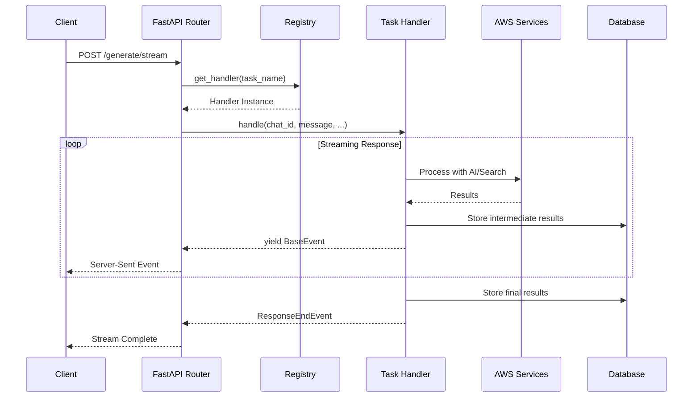

# Task Handlers: Technical Deep Dive

This guide provides comprehensive technical documentation about Chat Workbench's Task Handler system, covering architecture, implementation patterns, and advanced usage.

## Architecture Overview

Task Handlers are the core extensibility mechanism in Chat Workbench. They provide a standardized way to implement custom AI processing logic while leveraging the platform's infrastructure for streaming, authentication, and client management.

### Task Handler Lifecycle



## Base Task Handler Interface

All task handlers inherit from `BaseTaskHandler` and must implement the core interface:

```python
from abc import ABC, abstractmethod
from collections.abc import AsyncGenerator
from typing import Any
from app.models import Message
from app.services.streaming.events import BaseEvent

class BaseTaskHandler(ABC):
    """Base class for all task handlers."""

    @property
    @abstractmethod
    def name(self) -> str:
        """Unique identifier for this handler."""
        pass

    @property
    @abstractmethod
    def description(self) -> str:
        """Human-readable description of handler functionality."""
        pass

    @abstractmethod
    async def handle(
        self,
        chat_id: str,
        message_history: list[Message],
        user_message: Message,
        model_id: str,
        response_message_id: str,
        context: list[dict[str, Any]] | None = None,
        persona: str | None = None,
    ) -> AsyncGenerator[BaseEvent, None]:
        """
        Process the user's request and yield streaming events.

        This is where your custom AI logic lives.
        """
        pass
```

### Key Concepts

#### 1. **Streaming Event Architecture**

Task handlers communicate with clients through streaming events, not direct responses:

```python
# ❌ Wrong - Direct return
async def handle(self, ...):
    result = "Here's my response"
    return result

# ✅ Correct - Streaming events
async def handle(self, ...):
    yield StatusEvent(message="Processing...")
    yield ContentEvent(content="Here's my response")
    yield ResponseEndEvent(status="completed")
```

#### 2. **Event Types**

Different event types serve different purposes:

```python
from app.services.streaming.events import (
    ContentEvent,      # Main response content
    StatusEvent,       # Progress updates
    ToolCallEvent,     # Tool invocation
    ToolReturnEvent,   # Tool results
    DocumentEvent,     # Document references
    CitationEvent,     # Source citations
    MetadataEvent,     # Additional metadata
    ErrorEvent,        # Error information
    ResponseEndEvent,  # Required final event
)
```

#### 3. **Client Injection**

Handlers receive AWS service clients through dependency injection:

```python
class MyHandler(BaseTaskHandler):
    def __init__(
        self,
        bedrock_runtime_client: BedrockRuntimeClient,
        opensearch_client: OpenSearchClient,
        dynamodb_client: DynamoDBClient | None = None,
    ):
        super().__init__(dynamodb_client)
        self._bedrock = bedrock_runtime_client
        self._opensearch = opensearch_client
```

## Event System Deep Dive

### Event Structure

All events inherit from `BaseEvent` and include common fields:

```python
@dataclass
class BaseEvent:
    response_id: str        # Links event to specific response
    sequence: int          # Order of events in stream
    emit: bool = True      # Whether to send to client
    persist: bool = True   # Whether to store in database
```

### Content Events

The primary way to send response content to users:

```python
yield ContentEvent(
    response_id=response_message_id,
    content="Your AI-generated response here",
    sequence=1,
    emit=True,      # Send to client immediately
    persist=True,   # Store in database
)
```

### Status Events

Keep users informed of processing progress:

```python
yield StatusEvent(
    response_id=response_message_id,
    status='processing',
    message='Searching knowledge base...',
    sequence=0,
    emit=True,      # Shows progress indicator in UI
    persist=False,  # Don't store temporary status
)
```

### Tool Events

For complex workflows involving tool calls:

```python
# Tool invocation
yield ToolCallEvent(
    response_id=response_message_id,
    tool_name='knowledge_search',
    tool_id='search-123',
    tool_args={'query': user_query, 'max_results': 5},
    sequence=1,
    emit=True,
    persist=True,
)

# Tool result
yield ToolReturnEvent(
    response_id=response_message_id,
    tool_name='knowledge_search',
    tool_id='search-123',
    result={'documents': [...], 'status': 'success'},
    sequence=2,
    emit=True,
    persist=True,
)
```

### Document and Citation Events

For RAG systems that reference external sources:

```python
# Document reference
yield DocumentEvent(
    response_id=response_message_id,
    document_id='doc-123',
    title='Research Paper on AI Safety',
    pointer='s3://bucket/documents/paper.pdf',
    mime_type='application/pdf',
    page_count=25,
    word_count=8500,
    sequence=3,
    emit=True,
    persist=True,
)

# Specific citation
yield CitationEvent(
    response_id=response_message_id,
    document_id='doc-123',
    text='AI alignment is crucial for safe deployment',
    page=12,
    section='Conclusions',
    citation_id='1',
    sequence=4,
    emit=True,
    persist=True,
)
```

### Response End Event

**Required** - Every handler must end with this event:

```python
yield ResponseEndEvent(
    response_id=response_message_id,
    status='completed',  # or 'error'
    usage={
        'prompt_tokens': 150,
        'completion_tokens': 200,
        'total_tokens': 350,
    },
    sequence=final_sequence_number,
    emit=True,
    persist=True,
)
```

## Implementation Patterns

### Pattern 1: Simple Bedrock Integration

Basic AI model interaction:

```python
class SimpleAIHandler(BaseTaskHandler):
    def __init__(self, bedrock_runtime_client: BedrockRuntimeClient, **kwargs):
        super().__init__(**kwargs)
        self._bedrock = bedrock_runtime_client

    async def handle(self, chat_id: str, user_message: Message, model_id: str,
                    response_message_id: str, **kwargs) -> AsyncGenerator[BaseEvent, None]:

        # Extract user input
        user_text = self._extract_text(user_message)

        # Status update
        yield StatusEvent(
            response_id=response_message_id,
            status='processing',
            message='Generating AI response...',
            sequence=0,
            emit=True,
            persist=False,
        )

        try:
            # Call Bedrock
            client = await self._bedrock.get_sync_client()

            request_body = {
                "anthropic_version": "bedrock-2023-05-31",
                "max_tokens": 2000,
                "messages": [{"role": "user", "content": user_text}]
            }

            response = client.invoke_model(
                modelId=model_id,
                body=json.dumps(request_body)
            )

            response_body = json.loads(response.get('body').read())
            answer = response_body['content'][0]['text']

            # Stream response
            yield ContentEvent(
                response_id=response_message_id,
                content=answer,
                sequence=1,
                emit=True,
                persist=True,
            )

        except Exception as e:
            logger.error(f"Error in AI processing: {e}")
            yield ContentEvent(
                response_id=response_message_id,
                content=f"Error: {str(e)}",
                sequence=1,
                emit=True,
                persist=True,
            )

        # Always end with completion
        yield ResponseEndEvent(
            response_id=response_message_id,
            status='completed',
            usage={'prompt_tokens': 50, 'completion_tokens': 100, 'total_tokens': 150},
            sequence=2,
            emit=True,
            persist=True,
        )

    def _extract_text(self, message: Message) -> str:
        """Extract text content from message parts."""
        text = ""
        for part in message.parts:
            if hasattr(part, 'content') and part.content:
                text += str(part.content)
        return text
```

### Pattern 2: RAG with Knowledge Retrieval

Leveraging existing retrieval infrastructure:

```python
from app.task_handlers.chat.retrieval import (
    SearchRequest,
    search_knowledge_base,
    format_search_results,
)

class RAGHandler(BaseTaskHandler):
    def __init__(self, opensearch_client: OpenSearchClient,
                 bedrock_runtime_client: BedrockRuntimeClient, **kwargs):
        super().__init__(**kwargs)
        self._opensearch = opensearch_client
        self._bedrock = bedrock_runtime_client

    async def handle(self, **kwargs) -> AsyncGenerator[BaseEvent, None]:
        user_query = self._extract_text(kwargs['user_message'])
        response_id = kwargs['response_message_id']

        # Step 1: Search knowledge base
        yield StatusEvent(
            response_id=response_id,
            status='processing',
            message='Searching knowledge base...',
            sequence=0,
            emit=True,
            persist=False,
        )

        search_request = SearchRequest(
            keyword_queries=[user_query],
            semantic_query=user_query,
            max_results=5
        )

        search_results = await search_knowledge_base(
            self._opensearch,
            self._bedrock,
            search_request
        )

        # Step 2: Emit document events
        for doc in search_results.documents:
            yield DocumentEvent(
                response_id=response_id,
                document_id=doc.document_id,
                title=doc.title,
                pointer=doc.source.get('url', ''),
                mime_type='application/pdf',
                sequence=1,
                emit=True,
                persist=True,
            )

        # Step 3: Generate response with context
        yield StatusEvent(
            response_id=response_id,
            status='processing',
            message='Generating response...',
            sequence=2,
            emit=True,
            persist=False,
        )

        context = format_search_results(search_results)

        system_prompt = """Use the provided context to answer the user's question.
        Cite specific sources when possible."""

        user_prompt = f"Context: {context}\n\nQuestion: {user_query}"

        # Generate AI response (implementation similar to Pattern 1)
        # ... Bedrock call with context

        yield ContentEvent(
            response_id=response_id,
            content=ai_response,
            sequence=3,
            emit=True,
            persist=True,
        )

        yield ResponseEndEvent(
            response_id=response_id,
            status='completed',
            usage={'prompt_tokens': 200, 'completion_tokens': 150, 'total_tokens': 350},
            sequence=4,
            emit=True,
            persist=True,
        )
```

### Pattern 3: Multi-Step Workflow

Complex processing with multiple stages:

```python
class WorkflowHandler(BaseTaskHandler):
    async def handle(self, **kwargs) -> AsyncGenerator[BaseEvent, None]:
        response_id = kwargs['response_message_id']

        # Step 1: Initial processing
        yield StatusEvent(response_id=response_id, message="Step 1: Analyzing input...")
        step1_result = await self._process_step1(kwargs['user_message'])

        # Step 2: External API call
        yield StatusEvent(response_id=response_id, message="Step 2: Calling external service...")
        yield ToolCallEvent(
            response_id=response_id,
            tool_name='external_api',
            tool_args={'input': step1_result},
            sequence=1,
        )

        step2_result = await self._call_external_api(step1_result)

        yield ToolReturnEvent(
            response_id=response_id,
            tool_name='external_api',
            result=step2_result,
            sequence=2,
        )

        # Step 3: Final AI processing
        yield StatusEvent(response_id=response_id, message="Step 3: Generating final response...")
        final_response = await self._generate_final_response(step1_result, step2_result)

        yield ContentEvent(
            response_id=response_id,
            content=final_response,
            sequence=3,
        )

        yield ResponseEndEvent(response_id=response_id, status='completed', sequence=4)
```

## Advanced Features

### Custom Event Types

You can create custom event types for specialized use cases:

```python
from dataclasses import dataclass
from app.services.streaming.events import BaseEvent

@dataclass
class CustomAnalysisEvent(BaseEvent):
    """Custom event for analysis results."""
    analysis_type: str
    confidence_score: float
    data: dict

# Usage in handler
yield CustomAnalysisEvent(
    response_id=response_id,
    analysis_type='sentiment',
    confidence_score=0.92,
    data={'sentiment': 'positive', 'keywords': ['AI', 'innovation']},
    sequence=1,
)
```

### Error Handling Strategies

#### Graceful Degradation

```python
async def handle(self, **kwargs) -> AsyncGenerator[BaseEvent, None]:
    try:
        # Primary processing path
        result = await self._primary_processing()
        yield ContentEvent(content=result, ...)
    except PrimaryServiceError:
        # Fall back to secondary method
        logger.warning("Primary service failed, using fallback")
        try:
            result = await self._fallback_processing()
            yield ContentEvent(content=result, ...)
        except Exception as e:
            # Final fallback
            yield ContentEvent(content="Processing temporarily unavailable", ...)
    except Exception as e:
        # Unexpected error
        logger.error(f"Unexpected error: {e}")
        yield ErrorEvent(error_type=type(e).__name__, message=str(e), ...)
    finally:
        yield ResponseEndEvent(status='completed', ...)
```

#### Partial Success Handling

```python
async def handle(self, **kwargs) -> AsyncGenerator[BaseEvent, None]:
    results = []
    errors = []

    for item in input_items:
        try:
            result = await self._process_item(item)
            results.append(result)
        except Exception as e:
            errors.append(f"Failed to process {item}: {e}")
            continue

    if results:
        yield ContentEvent(content=f"Processed {len(results)} items successfully")
        # Include results...

    if errors:
        yield ContentEvent(content=f"Encountered {len(errors)} errors:")
        for error in errors:
            yield ContentEvent(content=f"- {error}")

    status = 'completed' if results else 'error'
    yield ResponseEndEvent(status=status, ...)
```

### Performance Optimization

#### Concurrent Processing

```python
import asyncio

async def handle(self, **kwargs) -> AsyncGenerator[BaseEvent, None]:
    # Process multiple items concurrently
    tasks = [
        self._process_item(item)
        for item in input_items
    ]

    # Process as they complete
    for coro in asyncio.as_completed(tasks):
        result = await coro
        yield ContentEvent(content=f"Completed: {result}")

    yield ResponseEndEvent(status='completed', ...)
```

#### Streaming Large Responses

```python
async def handle(self, **kwargs) -> AsyncGenerator[BaseEvent, None]:
    # For very large responses, chunk the content
    large_response = await self._generate_large_response()

    chunk_size = 1000
    for i, chunk in enumerate(self._chunk_text(large_response, chunk_size)):
        yield ContentEvent(
            response_id=response_id,
            content=chunk,
            sequence=i,
            emit=True,
            persist=True,
        )

    yield ResponseEndEvent(status='completed', ...)

def _chunk_text(self, text: str, size: int) -> list[str]:
    """Split text into chunks of specified size."""
    return [text[i:i+size] for i in range(0, len(text), size)]
```

## Registration and Configuration

### Handler Registration

Handlers are registered in `backend/app/task_handlers/registry.py`:

```python
async def initialize_task_handlers(
    settings: Settings,
    registry: TaskHandlerRegistry,
    client_registry: ClientRegistry | None = None,
) -> TaskHandlerRegistry:

    # Get required clients
    bedrock_client = client_registry.get_typed_client('bedrock_runtime', BedrockRuntimeClient)
    opensearch_client = client_registry.get_typed_client('opensearch', OpenSearchClient)

    # Register handlers with their dependencies
    if bedrock_client and opensearch_client:
        registry.register(MyHandler(bedrock_client, opensearch_client))
        logger.info('Registered MyHandler')
    else:
        logger.warning('MyHandler not registered - missing required clients')

    return registry
```

### Configuration Management

Handlers can access configuration through the settings system:

```python
# In config.py
class MyHandlerConfig(BaseModel):
    max_items: int = 100
    timeout_seconds: int = 30
    api_endpoint: str = "https://api.example.com"

class Settings(BaseSettings):
    my_handler: MyHandlerConfig = MyHandlerConfig()

# In handler
class MyHandler(BaseTaskHandler):
    def __init__(self, settings: Settings, **kwargs):
        super().__init__(**kwargs)
        self._config = settings.my_handler

    async def handle(self, **kwargs):
        # Use configuration
        timeout = self._config.timeout_seconds
        endpoint = self._config.api_endpoint
```

## Testing Task Handlers

### Unit Testing

```python
import pytest
from unittest.mock import Mock, AsyncMock
from app.task_handlers.my_handler import MyHandler

class TestMyHandler:
    @pytest.fixture
    def mock_clients(self):
        bedrock_client = Mock()
        bedrock_client.get_sync_client = AsyncMock()
        return {'bedrock': bedrock_client}

    @pytest.fixture
    def handler(self, mock_clients):
        return MyHandler(**mock_clients)

    def test_handler_properties(self, handler):
        assert handler.name == 'my_handler'
        assert 'custom processing' in handler.description.lower()

    @pytest.mark.asyncio
    async def test_handle_success(self, handler, mock_clients):
        # Mock Bedrock response
        mock_clients['bedrock'].get_sync_client.return_value.invoke_model.return_value = {
            'body': Mock(read=Mock(return_value='{"content": [{"text": "Test response"}]}'))
        }

        # Create test message
        from app.models import Message, MessagePart
        message = Message(parts=[MessagePart(content="Test query")])

        # Execute handler
        events = []
        async for event in handler.handle(
            chat_id="test-chat",
            user_message=message,
            model_id="claude-3",
            response_message_id="test-response",
            message_history=[],
        ):
            events.append(event)

        # Verify events
        content_events = [e for e in events if isinstance(e, ContentEvent)]
        assert len(content_events) > 0
        assert "Test response" in content_events[0].content

        # Verify completion
        end_events = [e for e in events if isinstance(e, ResponseEndEvent)]
        assert len(end_events) == 1
        assert end_events[0].status == 'completed'
```

### Integration Testing

```python
@pytest.mark.integration
class TestMyHandlerIntegration:
    @pytest.fixture
    async def app_client(self):
        # Set up test FastAPI client with real dependencies
        from app.api.main import create_app
        return TestClient(create_app())

    async def test_handler_via_api(self, app_client):
        response = app_client.post(
            "/api/v1/generate/stream",
            json={
                "chat_id": "test-chat",
                "task": "my_handler",
                "message": {
                    "parts": [{"content": "Test integration"}]
                }
            }
        )

        assert response.status_code == 200

        # Parse Server-Sent Events
        events = []
        for line in response.iter_lines():
            if line.startswith(b'data: '):
                event_data = json.loads(line[6:])
                events.append(event_data)

        # Verify event sequence
        assert len(events) > 0
        assert events[-1]['type'] == 'response_end'
        assert events[-1]['status'] == 'completed'
```

## Best Practices

### 1. **Always Emit ResponseEndEvent**

```python
# ✅ Correct
try:
    # ... processing
    yield ContentEvent(...)
except Exception:
    # ... error handling
finally:
    yield ResponseEndEvent(status='completed' or 'error', ...)

# ❌ Wrong - missing end event
yield ContentEvent(...)
return  # Stream never properly closes
```

### 2. **Use Appropriate Event Types**

```python
# ✅ Correct - Use status for progress
yield StatusEvent(message="Processing step 1...")
yield StatusEvent(message="Processing step 2...")
yield ContentEvent(content="Final result")

# ❌ Wrong - Don't use content for progress
yield ContentEvent(content="Processing step 1...")
yield ContentEvent(content="Processing step 2...")
yield ContentEvent(content="Final result")
```

### 3. **Handle Client Dependencies Gracefully**

```python
# ✅ Correct - Check availability in registry
if required_client:
    registry.register(MyHandler(required_client))
else:
    logger.warning("MyHandler not registered - missing required_client")

# ❌ Wrong - Will fail at runtime
registry.register(MyHandler(None))  # NoneType error later
```

### 4. **Provide Meaningful Error Messages**

```python
# ✅ Correct - User-friendly error
except ValidationError as e:
    yield ContentEvent(content="Please check your input format and try again.")
    logger.error(f"Validation error: {e}")

# ❌ Wrong - Technical error exposed to user
except ValidationError as e:
    yield ContentEvent(content=f"ValidationError: {str(e)}")
```

### 5. **Use Sequence Numbers Consistently**

```python
# ✅ Correct - Sequential numbering
sequence = 0
yield StatusEvent(..., sequence=sequence)
sequence += 1
yield ContentEvent(..., sequence=sequence)
sequence += 1
yield ResponseEndEvent(..., sequence=sequence)

# ❌ Wrong - Random or duplicate sequences
yield StatusEvent(..., sequence=0)
yield ContentEvent(..., sequence=0)  # Duplicate
yield ResponseEndEvent(..., sequence=5)  # Gap
```

## Debugging and Monitoring

### Logging

```python
import logging
from loguru import logger

class MyHandler(BaseTaskHandler):
    async def handle(self, **kwargs):
        logger.info(f"Processing request for user: {kwargs.get('user_id')}")

        try:
            result = await self._process()
            logger.debug(f"Processing result: {result}")
            yield ContentEvent(content=result, ...)
        except Exception as e:
            logger.error(f"Processing failed: {e}", exc_info=True)
            raise
```

### Metrics and Monitoring

```python
import time
from app.services.metrics import metrics_client

class MyHandler(BaseTaskHandler):
    async def handle(self, **kwargs):
        start_time = time.time()

        try:
            # Your processing logic
            result = await self._process()

            # Record success metric
            metrics_client.increment('handler.success', tags={'handler': self.name})

            yield ContentEvent(content=result, ...)

        except Exception as e:
            # Record error metric
            metrics_client.increment('handler.error', tags={
                'handler': self.name,
                'error_type': type(e).__name__
            })
            raise
        finally:
            # Record processing time
            duration = time.time() - start_time
            metrics_client.histogram('handler.duration', duration, tags={'handler': self.name})
```

This comprehensive guide covers the technical aspects of implementing task handlers in Chat Workbench. For step-by-step implementation instructions, see the [Creating Examples Guide](CREATING_EXAMPLES.md).
