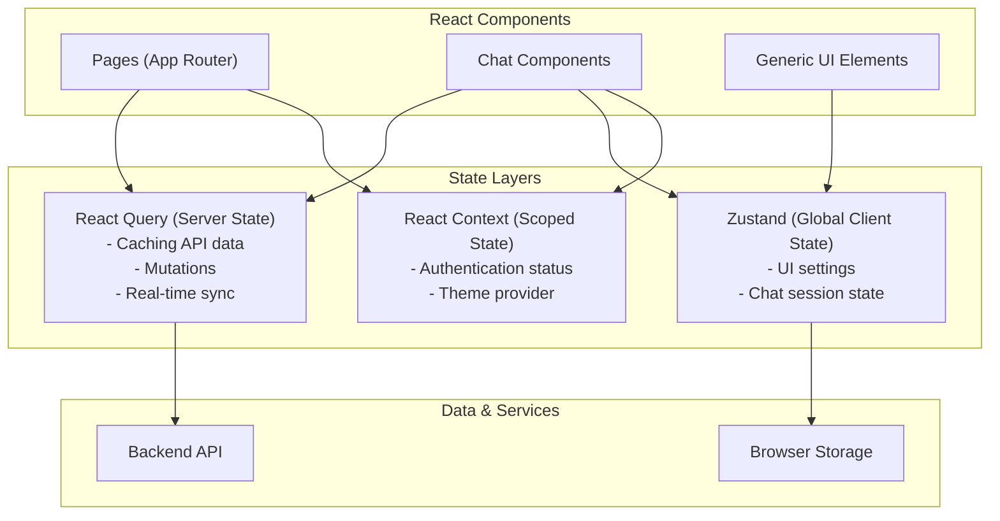
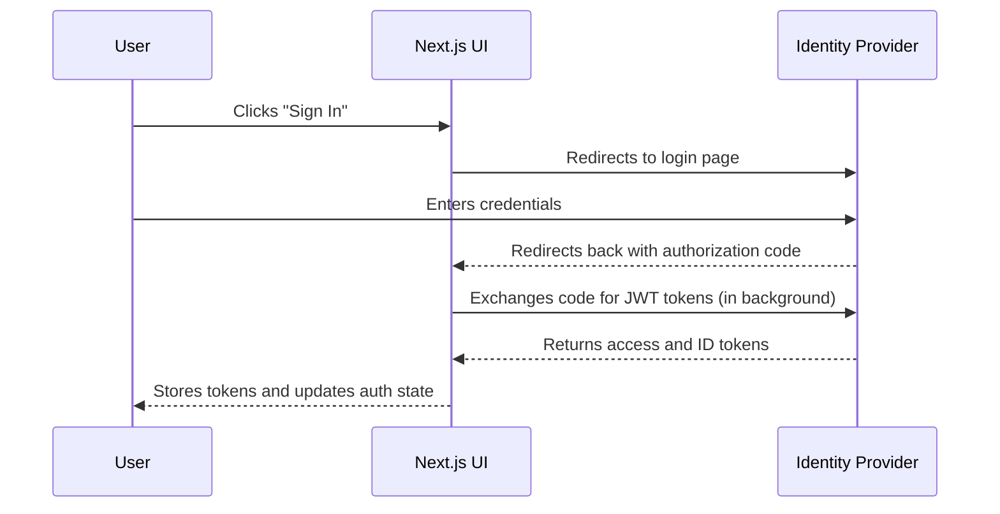
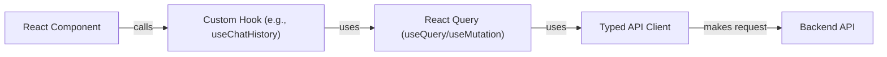

# Chat Workbench Frontend

This document provides a guide for developers working on the Chat Workbench frontend UI. The UI is a modern, responsive web application built with Next.js and React, designed to provide a seamless and interactive chat experience.

For a complete overview of the entire system, see the main [Architecture Guide](../../docs/ARCHITECTURE.md).

## Tech Stack

- **Framework**: [Next.js 15](https://nextjs.org/) (App Router)
- **Language**: [TypeScript](https://www.typescriptlang.org/)
- **UI Library**: [React 19](https://react.dev/)
- **Styling**: [Tailwind CSS](https://tailwindcss.com/)
- **State Management**:
  - [React Query](https://tanstack.com/query/latest) for server state, caching, and data synchronization.
  - [Zustand](https://zustand-demo.pmnd.rs/) for shared client-side state.
  - [React Context](https://react.dev/learn/passing-data-deeply-with-context) for authentication and theme information.
- **Authentication**: [OIDC (OpenID Connect)](https://openid.net/connect/) via `react-oidc-context`.

## Getting Started

### Prerequisites

- [Node.js](https://nodejs.org/) version 18+
- A running instance of the [Chat Workbench backend API](../../backend/README.md).

> **Note:** For first-time setup of the entire application stack (backend, databases, etc.), please follow the main [Getting Started Guide](../../docs/GETTING-STARTED.md).

### Local Development

1.  **Navigate to the UI directory:**

    ```bash
    cd ui
    ```

2.  **Install dependencies:**

    ```bash
    npm install
    ```

3.  **Run the development server:**
    ```bash
    npm run dev
    ```

The application will be available at [http://localhost:3000](http://localhost:3000). The development server uses hot-reloading, so changes you make to the code will be reflected in the browser automatically.

## Project Structure

The `ui/` directory is organized to promote separation of concerns and maintainability.

```
ui/
├── app/                    # Next.js app router pages and layouts
├── components/             # Reusable React components
│   ├── auth/               # Authentication-related components (login buttons, etc.)
│   ├── chat/               # Core chat interface components (message lists, input bar)
│   └── ui/                 # Generic, reusable UI elements (buttons, inputs, cards)
├── hooks/                  # Custom React hooks for shared logic
├── lib/                    # Core libraries, API client, and utility functions
├── public/                 # Static assets (images, fonts)
└── tailwind.config.ts      # Tailwind CSS configuration
```

## Architecture & Key Concepts

### State Management

The UI employs a hybrid state management strategy to efficiently handle different types of state.



- **React Query**: Used for all interactions with the backend API. It handles caching, background refetching, and optimistic updates, providing a responsive user experience.
- **Zustand**: Manages global client-side state that is not tied to the server, such as UI preferences or the state of the current chat session.
- **React Context**: Primarily used for providing globally accessible, but infrequently changing, data like the current user's authentication status and profile.

### Authentication

Authentication is handled via an OIDC flow, managed by `react-oidc-context`.



The UI stores tokens in `sessionStorage` and automatically attaches the bearer token to all API requests. For a detailed explanation of the full authentication architecture, see the [Authentication Flow Guide](../../docs/guides/AUTHENTICATION_FLOW.md).

### API Communication

All backend communication is centralized through a typed API client (`lib/api-client.ts`). Custom hooks in the `hooks/` directory abstract away the data-fetching logic, making it easy for components to request data without worrying about the implementation details.



This pattern ensures that data fetching is consistent, type-safe, and leverages the full power of React Query's caching. For details on available endpoints, see the [API Reference](../../docs/API-REFERENCE.md).

## Development Workflow

- **Linting**: Check for code quality and style issues.

  ```bash
  npm run lint
  ```

- **Type Checking**: Validate TypeScript types.

  ```bash
  npm run type-check
  ```

- **Testing**: Run unit and integration tests.

  ```bash
  npm run test
  ```

- **Production Build**: Create an optimized build for deployment.
  ```bash
  npm run build
  ```

## Deployment

The frontend is designed to be deployed as a Docker container via AWS ECS Fargate. The infrastructure is managed by the AWS CDK stacks in the `infrastructure/` directory.

The deployment can be configured to use a pre-built container image from ECR (Bring Your Own Container) for faster, decoupled deployments.

For more details, see the [Container Deployment Patterns](../docs/ARCHITECTURE.md#container-deployment-patterns) section in the architecture guide.
